# FastAPI Project Template


---

## 🚀 Start Here

**New to this template?** Follow this step-by-step guide:

1. **📖 [Getting Started Guide](docs/getting-started.md)** - Complete setup from zero to running app
2. **📚 [Tutorials Overview](docs/tutorials/TUTORIALS.md)** - All feature guides in one place
3. **🔐 [Authentication Tutorial](docs/tutorials/authentication.md)** - Build your user system
4. **🗄️ [Database Management](docs/tutorials/database-management.md)** - Add your own models
5. **🌐 [Deployment Guide](docs/tutorials/deployment-and-production.md)** - Go live with your app

**Quick clone and run:**
```bash
git clone https://github.com/triciaward/fast-api-template.git
cd fast-api-template
# Then follow the [Getting Started Guide](docs/getting-started.md)
```

---

## ⚡ Quick Start

### Prerequisites
- Python 3.11+
- PostgreSQL 13+
- Docker (optional)

### Installation
```bash
# Clone the repository
git clone https://github.com/triciaward/fast-api-template.git
cd fast-api-template

# Install dependencies
pip install -r requirements.txt

# Set up environment
cp .env.example .env
# Edit .env with your database credentials

# Run migrations
alembic upgrade head

# Start the server
uvicorn app.main:app --reload
```

### Docker Quick Start
```bash
# Start all services
docker-compose up -d

# Access the API
curl http://localhost:8000/health
```

> **What's Included by Default:**
> - ✅ User authentication (JWT, email verification, password reset)
> - ✅ PostgreSQL database with migrations
> - ✅ Complete test suite (360 tests)
> - ✅ Security features (rate limiting, CORS, audit logging)
> - ✅ Health checks and monitoring
>
> **What's Optional (disabled by default):**
> - 🔧 Redis (caching, sessions) - Enable with `ENABLE_REDIS=true`
> - 🌐 WebSockets (real-time features) - Enable with `ENABLE_WEBSOCKETS=true`
> - 🔄 Celery (background tasks) - Enable with `ENABLE_CELERY=true`
> - 🔐 OAuth (Google/Apple login) - Configure OAuth credentials
> - 📧 Email notifications - Configure SMTP settings

---

## 📖 Documentation

### 🎯 **Getting Started**
- **[Complete Setup Guide](docs/getting-started.md)** - From zero to running application
- **[Tutorials Overview](docs/tutorials/TUTORIALS.md)** - All feature guides organized by skill level

### 🔧 **Feature Tutorials**
- **[Authentication System](docs/tutorials/authentication.md)** - User login, registration, OAuth, password reset
- **[Database Management](docs/tutorials/database-management.md)** - Models, migrations, CRUD operations
- **[Testing & Development](docs/tutorials/testing-and-development.md)** - Writing tests, debugging, CI/CD
- **[Deployment & Production](docs/tutorials/deployment-and-production.md)** - Going live, monitoring, scaling
- **[Optional Features](docs/tutorials/optional-features.md)** - Redis, WebSockets, Celery, error monitoring

### 📚 **Skill-Based Learning Paths**
- **👶 Beginners**: Getting Started → Authentication → Database Management
- **👨‍💻 Intermediate**: Authentication → Database → Testing → Deployment  
- **🚀 Advanced**: Quick Reference → Deployment → Optional Features

---

## 🏗️ Architecture & File Tree

```mermaid
graph TD
  A[app/]
  A1[api/ ← route handlers] --> A
  A2[core/ ← shared config + utilities] --> A
  A3[crud/ ← DB access logic] --> A
  A4[models/ ← SQLAlchemy models] --> A
  A5[schemas/ ← Pydantic schemas] --> A
  A6[services/ ← business logic, external services] --> A
  A7[utils/ ← utility functions] --> A
  B[alembic/ ← DB migrations]
  C[tests/ ← full test suite]
  D[scripts/ ← utility scripts]
  E[docker-compose.yml]
  F[Dockerfile]
  G[requirements.txt]
```



---

## Who is this for?

> **This template is for beginners to intermediate devs who want a production-ready FastAPI backend with batteries included.**
>
> - Learn by example with clear, step-by-step tutorials
> - Get started quickly with authentication, database, and testing
> - Grow into advanced features (Celery, Redis, WebSockets, CI/CD)

---

## 📚 Table of Contents

- [🚀 Start Here](#-start-here)
- [📖 Documentation](#-documentation)
- [🏗️ Architecture & File Tree](#️-architecture--file-tree)
- [Who is this for?](#who-is-this-for)
- [Overview](#overview)
- [Quick Start](#quick-start)
- [Core Features](#core-features)
- [Optional Features](#optional-features)
- [Test Suite](#test-suite)
- [Project Structure](#project-structure)
- [Authentication & Security](#authentication--security)
- [API Documentation](#api-documentation)
- [Docker & Deployment](#docker--deployment)
- [Development](#development)
- [Monitoring & Logging](#monitoring--logging)
- [Contributing](#contributing)

---

## Overview

A robust FastAPI project template with **hybrid async/sync architecture** optimized for both development and production. Features comprehensive testing (360 tests passing), secure authentication with email verification, OAuth, and password reset, comprehensive input validation, PostgreSQL integration, and a fully working CI/CD pipeline.

### 🎯 **Core Features**
- **Authentication**: JWT + bcrypt + Email Verification + OAuth + Password Reset
- **Security**: GDPR-compliant account deletion, refresh token management, audit logging
- **Database**: PostgreSQL with Alembic migrations, soft delete, search & filtering
- **Testing**: 360 tests passing, comprehensive coverage, CI/CD pipeline
- **Quality**: Type safety (mypy), linting (ruff), pre-commit hooks
- **Monitoring**: Health checks, structured logging, rate limiting
- **Development Tools**: CRUD scaffolding CLI for rapid development

### 🚀 **Optional Features**
- **Redis**: Caching, sessions, rate limiting backend
- **WebSocket**: Real-time communication with room support
- **Celery**: Background task processing with eager mode testing
- **Error Monitoring**: GlitchTip/Sentry integration for production error tracking
- **Advanced Monitoring**: ELK stack ready logging


## 🏗️ Project Structure

```text
fast-api-template/
├── app/                          # Main application code
│   ├── api/                      # API endpoints
│   │   └── api_v1/
│   │       └── endpoints/        # Route handlers
│   ├── core/                     # Core configuration
│   ├── crud/                     # Database operations
│   ├── models/                   # SQLAlchemy models
│   ├── schemas/                  # Pydantic schemas
│   ├── services/                 # Business logic
│   └── utils/                    # Utility functions
├── alembic/                      # Database migrations
├── tests/                        # Test suite
├── scripts/                      # Utility scripts
├── docker-compose.yml            # Docker services
├── Dockerfile                    # Application container
└── requirements.txt              # Python dependencies
```

---

## Core Features

### 🔐 Authentication System
- **JWT Tokens**: Secure token-based authentication
- **Email Verification**: Complete email verification workflow
- **OAuth Integration**: Google and Apple OAuth support
- **Password Management**: Reset, change, and strength validation
- **GDPR Compliance**: Account deletion with grace period
- **Session Management**: Refresh tokens with multi-device support

### 🗄️ Database & Data Management
- **PostgreSQL**: Primary database with proper indexing
- **Connection Pooling**: Optimized connection management with configurable pools
- **Alembic Migrations**: Version-controlled schema changes
- **Soft Delete**: Comprehensive soft delete with restoration
- **Search & Filter**: Advanced text search and field filtering
- **Pagination**: Type-safe pagination with HATEOAS links
- **Audit Logging**: Complete user activity tracking

### 🛡️ Security & Validation
- **Input Validation**: SQL injection protection, XSS prevention
- **Rate Limiting**: Configurable per-endpoint rate limiting
- **CORS**: Configurable cross-origin resource sharing
- **Error Handling**: Standardized error responses with codes
- **Type Safety**: Complete mypy type checking

### 🚀 Development Tools
- **CRUD Scaffolding**: Generate complete CRUD boilerplate with one command
- **Auto-registration**: Automatically wire new endpoints into the API router
- **Consistent Patterns**: Follow established conventions for models, schemas, and endpoints
- **Test Generation**: Basic test files included for immediate testing

---

## 🛠️ CRUD Scaffolding CLI

**Boost your development speed with automated CRUD generation!**

Instead of manually creating models, schemas, CRUD operations, endpoints, and tests, use the built-in scaffolding tool to generate everything with one command.

### Quick Example

```bash
# Generate a Post model with soft delete
python scripts/generate_crud.py Post title:str content:str is_published:bool --soft-delete

# Generate a Product model with search functionality
python scripts/generate_crud.py Product name:str price:float description:str --searchable

# Generate a Category model with admin features
python scripts/generate_crud.py Category name:str slug:str --admin --slug
```

### What Gets Generated

✅ **Model** (`app/models/post.py`) - SQLAlchemy model with proper fields and relationships  
✅ **Schemas** (`app/schemas/post.py`) - Pydantic schemas for create, update, and response  
✅ **CRUD** (`app/crud/post.py`) - Database operations (create, read, update, delete)  
✅ **Endpoints** (`app/api/api_v1/endpoints/post.py`) - FastAPI route handlers  
✅ **Tests** (`tests/template_tests/test_post.py`) - Basic test coverage  
✅ **Auto-registration** - Automatically added to API router  

### Available Options

- `--soft-delete` - Include soft delete functionality with restoration
- `--searchable` - Add search and filtering capabilities
- `--admin` - Include admin panel integration
- `--slug` - Auto-generate slug field from title

### Generated API Endpoints

```bash
GET    /api/v1/posts          # List all posts
POST   /api/v1/posts          # Create new post
GET    /api/v1/posts/{id}     # Get specific post
PUT    /api/v1/posts/{id}     # Update post
DELETE /api/v1/posts/{id}     # Delete post (soft delete if enabled)
```

### Next Steps After Generation

1. **Review generated files** - Customize business logic as needed
2. **Run migrations** - `alembic revision --autogenerate -m 'Add Post model'`
3. **Apply migrations** - `alembic upgrade head`
4. **Test endpoints** - `pytest tests/template_tests/test_post.py`

### Supported Field Types

- `str` - String fields
- `int` - Integer fields  
- `float` - Float/decimal fields
- `bool` - Boolean fields
- `datetime` - Date/time fields
- `date` - Date fields
- `uuid` - UUID fields
- `text` - Long text fields
- `json` - JSON fields

---

## Optional Features

### 🎯 Redis Integration
- **Caching**: Response caching for improved performance
- **Sessions**: User session management
- **Rate Limiting**: Redis-backed rate limiting
- **Health Checks**: Redis connection monitoring

### 🌐 WebSocket Support
- **Real-time Communication**: WebSocket endpoints
- **Room Management**: Multi-room chat functionality
- **Connection Handling**: Proper connection lifecycle management
- **Testing**: Comprehensive WebSocket testing

### 🔄 Background Tasks
- **Celery Integration**: Asynchronous task processing
- **Task Management**: Submit, monitor, and cancel tasks
- **Eager Mode**: Synchronous execution during testing
- **Health Integration**: Task status in health checks

### 🚨 Error Monitoring
- **GlitchTip Integration**: Self-hosted Sentry-compatible error tracking
- **Sentry SDK**: FastAPI integration with automatic error capture
- **Performance Monitoring**: Request tracing and profiling
- **User Context**: Automatic user identification in error reports
- **Request Context**: Enhanced request information for better debugging
- **Health Validation**: Real-time Sentry connection status checking
- **Test Endpoint**: `/health/test-sentry` for monitoring validation
- **Fail-Safe Design**: Graceful degradation when Sentry is unavailable

---

## Test Suite

- **360 Core Tests**: All passing with comprehensive coverage
- **152 Skipped Tests**: Complex features (OAuth, account deletion, etc.)
- **76 Async Tests**: Deselected in CI to prevent hangs
- **60% Code Coverage**: Proper async testing with fixtures
- **100% Optional Features**: Complete coverage when enabled

> **Note:** The default test coverage threshold is set to 50% to make it easy to start new projects from this template. As you build out your app and implement more features, you should raise the threshold to encourage better test coverage.

---

## Authentication & Security

### Standardized Error Responses
All API endpoints return consistent error formats:

```json
{
  "error": {
    "type": "ValidationError",
    "message": "Invalid email format",
    "code": "INVALID_EMAIL",
    "details": {}
  }
}
```

### Security Features
- **JWT Token Management**: Secure token generation and validation
- **Password Security**: bcrypt hashing with strength validation
- **Rate Limiting**: Configurable per-endpoint limits
- **Input Sanitization**: SQL injection and XSS protection
- **Audit Logging**: Complete security event tracking

---

## API Documentation

### Interactive Documentation
- **Swagger UI**: Available at `/docs`
- **ReDoc**: Available at `/redoc`
- **OpenAPI Schema**: Available at `/openapi.json`

### Key Endpoints
- **Health**: `/health`, `/health/simple`, `/health/ready`, `/health/live`, `/health/rate-limit`, `/health/test-sentry`
- **Authentication**: `/api/v1/auth/login`, `/api/v1/auth/register`
- **Users**: `/api/v1/users/` (CRUD operations)
- **Admin**: `/api/v1/admin/` (Admin-only operations)
- **Root**: `/` (application info), `/features` (enabled features)
- **Optional**: `/api/v1/ws/` (WebSockets), `/api/v1/celery/` (background tasks)

---

## Docker & Deployment

### Database Connection Pooling

This template includes comprehensive database connection pooling for optimal performance:

**SQLAlchemy Pool Configuration:**
- **Pool Size**: 20 connections (configurable via `DB_POOL_SIZE`)
- **Max Overflow**: 30 additional connections (configurable via `DB_MAX_OVERFLOW`)
- **Connection Recycling**: 1 hour (configurable via `DB_POOL_RECYCLE`)
- **Health Checks**: Pre-ping validation (configurable via `DB_POOL_PRE_PING`)
- **Timeout**: 30 seconds (configurable via `DB_POOL_TIMEOUT`)

**pgBouncer Integration (Optional):**
```bash
# Start with pgBouncer for advanced pooling
docker-compose --profile pgbouncer up -d
```

**Pool Monitoring:**
- Health endpoint `/health` includes real-time pool metrics
- Monitor connection usage, overflow, and invalid connections
- Automatic connection validation and recycling
- Real-time pool statistics in health check responses
- Connection pool health integration with Kubernetes probes

### Docker Services
```yaml
services:
  app:          # FastAPI application
  postgres:     # PostgreSQL database
  redis:        # Redis cache (optional)
  celery:       # Background tasks (optional)
  glitchtip:    # Error monitoring (optional)
```

### Production Deployment
- **Environment Variables**: Comprehensive configuration
- **Health Checks**: Application and service monitoring with connection pool metrics
- **Logging**: Structured JSON logging
- **Security**: Proper container security practices
- **Error Monitoring**: Production-ready Sentry/GlitchTip integration
- **Connection Pooling**: Optimized database connection management
- **Security Recommendations**: 
  - Secure GlitchTip behind authentication (basic/JWT)
  - Use reverse proxy (Caddy) with Cloudflare protection
  - Enable HTTPS for all monitoring endpoints

---

## Development

### Code Quality
- **Pre-commit Hooks**: Automated linting and type checking
- **mypy**: Static type checking with zero errors
- **ruff**: Fast Python linter with zero warnings
- **black**: Code formatting

### Code Quality (Pre-commit Hooks)
This project uses pre-commit hooks to ensure code quality before every commit.

**Installation:**
```bash
pre-commit install
```

**Available Hooks:**
- **ruff**: Fast Python linter with zero warnings
- **black**: Code formatting
- **mypy**: Static type checking with zero errors

**Configuration:** See `.pre-commit-config.yaml` for the complete list of hooks and their settings.

### Development Workflow
```bash
# Install pre-commit hooks
./scripts/install_precommit.sh

# Run tests
pytest

# Run linting
./scripts/lint.sh

# Format code
black .
```

### Testing
- **Health Endpoints**: Comprehensive testing of all health check endpoints
- **Connection Pooling**: Full test coverage for SQLAlchemy and pgBouncer integration
- **Integration Tests**: End-to-end testing of health monitoring with all optional features
- **Test Coverage**: 100% coverage for health and connection pooling functionality

### Utility Scripts
- **Bootstrap Admin**: `./scripts/bootstrap_admin.py`
- **Bootstrap Superuser**: `./scripts/bootstrap_superuser.sh`
- **Logging Demo**: `./scripts/logging_demo.py`
- **Database Setup**: `./scripts/setup.sh`
- **GlitchTip Setup**: `./scripts/setup_glitchtip.sh`
- **Pre-commit Setup**: `./scripts/install_precommit.sh`
- **Error Response Demo**: `./scripts/demo_error_responses.py`
- **Admin CLI**: `./scripts/admin_cli.py`

---

## Monitoring & Logging

### Structured Logging
- **JSON Format**: Machine-readable logs
- **Console Output**: Colored human-readable logs
- **File Rotation**: Automatic log file management
- **ELK Ready**: Compatible with ELK stack

### Health Monitoring

**Comprehensive Health Check (`/health`):**
```bash
curl http://localhost:8000/health
```

Returns detailed status including:
- Database connectivity and connection pool metrics
- Redis health (when enabled)
- Rate limiting status (when enabled)
- Celery background task status (when enabled)
- Sentry error monitoring status
- Real-time connection pool statistics

**Response Example:**
```json
{
  "status": "healthy",
  "timestamp": "2024-01-01T12:00:00.000000",
  "version": "1.0.0",
  "environment": "development",
  "checks": {
    "database": "healthy",
    "application": "healthy",
    "redis": "disabled",
    "rate_limiting": "disabled",
    "celery": "disabled",
    "sentry": "disabled"
  },
  "database_pools": {
    "async": {
      "size": 20,
      "checked_in": 18,
      "checked_out": 2,
      "overflow": 0
    },
    "sync": {
      "size": 10,
      "checked_in": 9,
      "checked_out": 1,
      "overflow": 0
    }
  }
}
```

**Specialized Health Endpoints:**
- **Simple Health** (`/health/simple`) - Basic uptime monitoring
- **Readiness Check** (`/health/ready`) - Kubernetes readiness probes
- **Liveness Check** (`/health/live`) - Kubernetes liveness probes
- **Rate Limit Info** (`/health/rate-limit`) - Current rate limit status
- **Sentry Test** (`/health/test-sentry`) - Error monitoring validation

### Audit Logging
- **User Actions**: Complete activity tracking
- **Security Events**: Authentication and authorization events
- **System Events**: Background tasks and health checks
- **Database Storage**: Persistent audit trail

---

## 🤝 Contributing

1. Fork the repository
2. Create a feature branch
3. Make your changes
4. Run tests and linting
5. Submit a pull request

### Development Guidelines
- Follow PEP 8 style guidelines
- Add type annotations for all functions
- Write comprehensive tests
- Update documentation as needed

---

## 📄 License

This project is licensed under the MIT License - see the [LICENSE](LICENSE) file for details.

---

## 📞 Contact

- **GitHub**: [@triciaward](https://github.com/triciaward)
- **Issues**: [GitHub Issues](https://github.com/triciaward/fast-api-template/issues)
- **Discussions**: [GitHub Discussions](https://github.com/triciaward/fast-api-template/discussions)