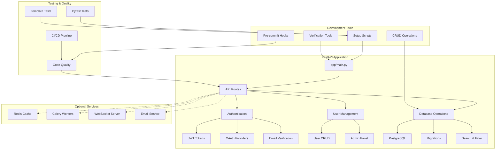

# FastAPI Template Tutorials

Welcome to the tutorials section! Here you'll find comprehensive guides for every feature in the FastAPI template, written in a beginner-friendly way.

> **📁 File Location**: This file is located at `docs/tutorials/TUTORIALS.md` in the project structure.

---

## 📋 Table of Contents

- [🚀 Start Here - Quick Navigation](#-start-here---quick-navigation)
- [🎯 Who is this for?](#-who-is-this-for)
- [🏗️ Project Architecture](#️-project-architecture)
- [📁 File Structure Overview](#-file-structure-overview)
- [📚 Tutorial Index](#-tutorial-index)
- [🎯 How to Use These Tutorials](#-how-to-use-these-tutorials)
- [📖 Tutorial Features](#-tutorial-features)
- [🛠️ Quick Reference](#️-quick-reference)
- [🎯 Learning Paths](#-learning-paths)
- [🤝 Getting Help](#-getting-help)
- [🎉 Success Stories](#-success-stories)
- [🔄 Keep Learning](#-keep-learning)

---

## 🚀 Start Here - Quick Navigation

**New to FastAPI?** Follow this path:
1. **📖 [Getting Started Guide](../TEMPLATE_README.md)** - Set up your development environment
2. **🤖 [AI Development Features](ai-development-features.md)** - Optimize AI assistant interactions
3. **🎯 [Next Steps & Development Tips](next-steps-and-tips.md)** - What to build first and common mistakes to avoid
4. **🔐 [Authentication System](authentication.md)** - Learn user login and registration
5. **🗄️ [Database Management](database-management.md)** - Work with data, migrations, and CRUD operations
6. **🌐 [Deployment and Production](deployment-and-production.md)** - Deploy to production
7. **🔧 [Optional Features](optional-features.md)** - Add advanced features as needed

**Experienced developer?** Jump to any tutorial or use the [Quick Reference](#️-quick-reference) section below.

---

## 🎯 Who is this for?

### 👶 **Beginners** (0-1 years experience)
- New to web development or Python
- Want to build a complete web application
- Need step-by-step guidance
- **Start with**: Getting Started → Authentication → Database Management

### 👨‍💻 **Intermediate Developers** (1-3 years experience)
- Know Python basics but new to FastAPI
- Want to build production-ready applications
- Need best practices and architecture guidance
- **Start with**: Authentication → Database Management → Testing

### 🚀 **Advanced Developers** (3+ years experience)
- Experienced with web frameworks
- Want to quickly understand the template structure
- Focus on deployment and scaling
- **Start with**: Quick Reference → Deployment → Optional Features

---

## 🏗️ Project Architecture



---

## 📁 File Structure Overview

```
fast-api-template/
├── 📁 app/                    # Main application code
│   ├── 📁 api/               # API endpoints and routes (domain-based)
│   │   ├── 📁 auth/          # Authentication endpoints
│   │   ├── 📁 users/         # User management endpoints
│   │   ├── 📁 system/        # System endpoints (health, metrics)
│   │   └── 📁 admin/         # Admin endpoints
│   ├── 📁 core/              # Configuration and core utilities
│   │   ├── 📁 config/        # Configuration management
│   │   ├── 📁 security/      # Security utilities
│   │   └── 📁 error_handling/ # Error handling
│   ├── 📁 crud/              # Database operations (domain-based)
│   │   ├── 📁 auth/          # Authentication CRUD
│   │   └── 📁 system/        # System CRUD
│   ├── 📁 models/            # Database models (domain-based)
│   │   ├── 📁 auth/          # Authentication models
│   │   ├── 📁 system/        # System models
│   │   └── 📁 core/          # Base models and mixins
│   ├── 📁 schemas/           # Pydantic schemas (domain-based)
│   │   ├── 📁 auth/          # Authentication schemas
│   │   ├── 📁 admin/         # Admin schemas
│   │   └── 📁 core/          # Core schemas
│   ├── 📁 services/          # Business logic and external services
│   │   ├── 📁 auth/          # Authentication services
│   │   ├── 📁 background/    # Background tasks
│   │   ├── 📁 external/      # External service integrations
│   │   ├── 📁 middleware/    # Middleware services
│   │   └── 📁 monitoring/    # Monitoring and audit services
│   └── 📁 utils/             # Utility functions
├── 📁 docs/                  # Documentation
│   └── 📁 tutorials/         # This tutorial section

├── 📁 scripts/               # Utility scripts (organized by purpose)
│   ├── 📁 setup/             # Setup and configuration scripts
│   ├── 📁 development/       # Development tools
│   └── 📁 admin/             # Administration scripts
├── 📄 docker-compose.yml     # Docker services
├── 📄 requirements.txt       # Python dependencies
└── 📄 .env                   # Environment variables
```

---

## 📚 Tutorial Index

### 🚀 Getting Started
- **[Getting Started Guide](../TEMPLATE_README.md)** - Complete setup guide for creating a new app from this template
- **[AI Development Features](ai-development-features.md)** - Optimize AI assistant interactions and reduce costs
- **[Agent Setup Guide](agent_setup.md)** - Ensure AI agents work correctly with your project environment
- **[Quick Reference](quick_reference.md)** - Common patterns, file locations, and project conventions
- **[Next Steps & Development Tips](next-steps-and-tips.md)** - What to build first, common commands, and mistakes to avoid

### 🎯 Template Customization
Transform the FastAPI template into your own project with the powerful customization system:
- **Interactive Customization**: Guided prompts to personalize your project
- **Comprehensive Replacement**: All template references updated automatically
- **Smart Defaults**: Auto-generated project names and configurations
- **Documentation Updates**: All docs updated to reflect your project
- **Git Integration**: Automatic remote repository detection and guidance
- **Safety Features**: Confirmation prompts and detailed logging

**Quick Start:**
```bash
# Clone the template
git clone <your-repo-url>
cd fast-api-template

# Step 1: Rename the template directory
./scripts/setup/rename_template.sh

# Step 2: Restart VS Code and open the renamed directory
code your_project_name

# Step 3: Customize for your project
python scripts/setup/customize_template.py

# Follow the prompts and start developing!
```

**What Gets Customized:**
- Project name and description
- Database names and configurations
- Docker container names
- Documentation and README files
- Configuration files and scripts
- Git remote setup guidance

### 🔧 Core Features

#### 🔐 [Authentication System](authentication.md)
Learn everything about user authentication, including:
- User registration and login
- Password management (reset, change)
- OAuth integration (Google, Apple)
- Email verification
- Security features (rate limiting, session management)

#### 🗄️ [Database Management](database-management.md)
Master database operations and management:
- PostgreSQL setup and configuration
- Database migrations with Alembic
- CRUD operations (Create, Read, Update, Delete)
- Search and filtering
- Pagination and audit logging
- Soft delete functionality
- **Domain-Based Organization**: CRUD operations organized by business domains

### ⚡ Optional Features

#### 🔧 [Optional Features](optional-features.md)
Explore advanced features that can enhance your application:
- **Redis**: Caching and session management
- **WebSockets**: Real-time communication
- **Celery**: Background task processing
- **Email**: Automated notifications
- **Admin CLI**: Terminal administration
- **Security Headers**: HTTP security protection

### 🛠️ Development & Testing

Learn best practices for development:
- Debugging techniques and tools
- Code quality tools (linting, formatting)
- Pre-commit hooks and CI/CD setup
- Development workflow best practices
- Template-specific tests and isolation

### 🏥 Production & Monitoring

#### 🏥 [Health Monitoring](health-monitoring.md)
Comprehensive health monitoring system:
- **8 Health Check Endpoints**: Basic, simple, readiness, liveness, detailed, database, metrics, rate limiting
- **Load Balancer Integration**: Simple health checks for load balancers
- **Kubernetes Probes**: Readiness and liveness probes for container orchestration
- **Database Monitoring**: Database-specific health and performance metrics
- **System Metrics**: CPU, memory, disk usage monitoring
- **External Service Checks**: Redis, email, OAuth provider status
- **Production Ready**: Enterprise-grade monitoring for production deployments

#### ⚡ [Performance Optimization](performance-optimization.md)
Performance monitoring and optimization tools:
- **Database Query Monitoring**: Automatic detection of slow queries
- **Request Performance Tracking**: Monitor endpoint response times
- **Caching System**: In-memory caching with TTL support
- **Query Analysis**: SQL analysis with optimization suggestions
- **Performance Utilities**: Decorators and utilities for optimization
- **Performance Alerts**: Automatic alerts for performance issues
- **Query Optimization**: Tools to optimize database queries

### 🚀 Production & Deployment

#### 🌐 [Deployment and Production](deployment-and-production.md)
Take your app from development to production:
- Docker deployment strategies
- Cloud platform deployment (Coolify, VPS, AWS)
- Production configuration and security

#### 💰 [Cost Optimization](cost-optimization.md)
Deploy your FastAPI app on a budget for solo developers:
- **$10-15/month deployment** instead of $50-100/month with managed services
- **Self-hosted solutions** - PostgreSQL, monitoring, and error tracking
- **Coolify deployment** with resource optimization
- **Budget configuration settings** for small VPS instances
- **Free monitoring setup** with Grafana + Prometheus
- **Cost comparison guides** and optimization strategies
- **VPS provider recommendations** for budget-conscious developers
- Monitoring and health checks
- Performance optimization
- Backup and recovery strategies

---

## 🎯 How to Use These Tutorials

### For Beginners
1. Start with the **[Getting Started Guide](../TEMPLATE_README.md)**
2. **Customize the template** for your project (see Template Customization section above)
3. Read the **[Authentication System](authentication.md)** tutorial
4. Learn about **[Database Management](database-management.md)**
5. Explore **[Optional Features](optional-features.md)** as needed
6. Read **[Deployment and Production](deployment-and-production.md)** when ready to deploy

### For Experienced Developers
- Jump directly to the tutorials you need
- Use the code examples as reference
- Focus on the configuration and best practices sections
- Check the troubleshooting sections for common issues

### For Teams
- Share relevant tutorials with team members
- Use the tutorials as onboarding materials
- Reference the best practices sections for code reviews
- Follow the deployment guide for production setup

---

## 📖 Tutorial Features

Each tutorial includes:

### 🎓 **Beginner-Friendly Explanations**
- Simple analogies to explain complex concepts
- Step-by-step instructions
- Clear explanations of what each feature does

### 💻 **Practical Examples**
- Real code examples you can copy and use
- API endpoint examples with curl commands
- Configuration file examples

### 🔧 **Hands-On Instructions**
- Complete setup steps
- Testing procedures
- Troubleshooting guides

### 🚨 **Common Issues & Solutions**
- Typical problems you might encounter
- Step-by-step solutions
- Prevention tips

### 🎯 **Best Practices**
- Security recommendations
- Performance optimization tips
- Code quality guidelines

---

## 🛠️ Quick Reference

### Essential Commands
```bash
# Start all services with Docker (recommended)
docker-compose up -d

# Run database migrations
alembic upgrade head

# View Docker logs
docker-compose logs -f

# Check application health
curl http://localhost:8000/system/health
```

### 🛠️ **Development Tools**
```bash
# Comprehensive setup
./scripts/setup/setup_comprehensive.sh

# Fix common issues
./scripts/setup/fix_common_issues.sh

# Verify setup
python scripts/setup/verify_setup.py

# Install pre-commit hooks
./scripts/git-hooks/install_precommit.sh
# or
pre-commit install && pre-commit run --all-files

# Run code quality checks
./scripts/development/validate_ci.sh
```

### Key Configuration Files
- `.env` - Environment variables
- `docker-compose.yml` - Docker services
- `alembic.ini` - Database migrations
- `requirements.txt` - Python dependencies
- `pyproject.toml` - Tool configurations
- `mypy.ini` - MyPy configuration

### Important URLs
- **API Documentation**: http://localhost:8000/docs
- **Health Check**: http://localhost:8000/system/health
- **Admin API**: http://localhost:8000/admin/users

### 🔧 Useful External Tools
- **[pgAdmin](https://www.pgadmin.org/)**: PostgreSQL database management
- **[Beekeeper Studio](https://www.beekeeperstudio.io/)**: Modern SQL editor
- **[Docker Desktop](https://www.docker.com/products/docker-desktop/)**: Container management
- **[Postman](https://www.postman.com/)**: API testing and documentation
- **[VS Code](https://code.visualstudio.com/)**: Recommended code editor

---

## 🎯 Learning Paths

### 🚀 **Quick Start Path** (1-2 hours)
1. [Getting Started Guide](../TEMPLATE_README.md)
2. [Authentication System](authentication.md) - Basic setup
3. Test the API at http://localhost:8000/docs

### 🔧 **Full Feature Path** (4-6 hours)
1. [Getting Started Guide](../TEMPLATE_README.md)
2. [Authentication System](authentication.md) - Complete
3. [Database Management](database-management.md) - Core features and CRUD operations
4. [Optional Features](optional-features.md) - Choose what you need

### 🌐 **Production Ready Path** (6-8 hours)
1. Complete the Full Feature Path
2. [Health Monitoring](health-monitoring.md) - Set up comprehensive monitoring
3. [Performance Optimization](performance-optimization.md) - Optimize and monitor performance
4. [Deployment and Production](deployment-and-production.md)
5. Set up monitoring and backups
6. Configure CI/CD pipeline

---

## 🤝 Getting Help

### 📖 **Documentation Resources**
- **FastAPI Official Docs**: https://fastapi.tiangolo.com/
- **SQLAlchemy Docs**: https://docs.sqlalchemy.org/
- **Alembic Docs**: https://alembic.sqlalchemy.org/
- **PostgreSQL Docs**: https://www.postgresql.org/docs/
- **Redis Docs**: https://redis.io/documentation

### 🐛 **Troubleshooting**
- Check the troubleshooting sections in each tutorial
- Review the [troubleshooting folder](../troubleshooting/) for specific issues
- Look at the test files for working examples
- Run the verification script: `python3 scripts/setup/verify_setup.py`

### 💬 **Community Support**
- **FastAPI Discord**: https://discord.gg/VQjSZaeJmf
- **Stack Overflow**: Tag questions with `fastapi`
- **GitHub Issues**: Report bugs in the template repository

---

## 🎉 Success Stories

After completing these tutorials, you'll be able to:

✅ **Build a complete web application** with user authentication  
✅ **Deploy to production** with confidence  
✅ **Handle real-world scenarios** like user management and data processing  
✅ **Scale your application** as it grows  
✅ **Maintain code quality** with testing and best practices  
✅ **Monitor and debug** production issues effectively  
✅ **Set up development environments** with one command  
✅ **Monitor application health** with comprehensive health checks  
✅ **Optimize performance** with advanced monitoring tools  
✅ **Track database performance** with query analysis and optimization  
✅ **Cache expensive operations** for better response times  
✅ **Use domain-based organization** for better code structure  
✅ **Implement async-first architecture** for better performance  

---

## 🔄 Keep Learning

The FastAPI ecosystem is constantly evolving. Stay updated by:

- Following the [FastAPI blog](https://fastapi.tiangolo.com/blog/)
- Reading the [SQLAlchemy changelog](https://docs.sqlalchemy.org/en/14/changelog/)
- Checking for template updates in the repository
- Experimenting with new features and libraries

---

**Happy coding! 🚀**

Remember: Every expert was once a beginner. Take your time, experiment, and don't be afraid to make mistakes. That's how you learn! 