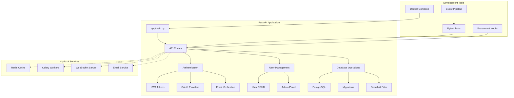

# FastAPI Template Tutorials

Welcome to the tutorials section! Here you'll find comprehensive guides for every feature in the FastAPI template, written in a beginner-friendly way.

> **📁 File Location**: This file is located at `docs/tutorials/TUTORIALS.md` in the project structure.

---

## 📋 Table of Contents

- [🚀 Start Here - Quick Navigation](#-start-here---quick-navigation)
- [🎯 Who is this for?](#-who-is-this-for)
- [🏗️ Project Architecture](#️-project-architecture)
- [📁 File Structure Overview](#-file-structure-overview)
- [📚 Tutorial Index](#-tutorial-index)
- [🎯 How to Use These Tutorials](#-how-to-use-these-tutorials)
- [📖 Tutorial Features](#-tutorial-features)
- [🛠️ Quick Reference](#️-quick-reference)
- [🎯 Learning Paths](#-learning-paths)
- [🤝 Getting Help](#-getting-help)
- [🎉 Success Stories](#-success-stories)
- [🔄 Keep Learning](#-keep-learning)

---

## 🚀 Start Here - Quick Navigation

**New to FastAPI?** Follow this path:
1. **📖 [Getting Started Guide](../getting-started.md)** - Set up your development environment
2. **🔐 [Authentication System](authentication.md)** - Learn user login and registration
3. **🗄️ [Database Management](database-management.md)** - Work with data, migrations, and CRUD scaffolding
4. **🧪 [Testing and Development](testing-and-development.md)** - Write tests and debug
5. **🌐 [Deployment and Production](deployment-and-production.md)** - Deploy to production
6. **🔧 [Optional Features](optional-features.md)** - Add advanced features as needed

**Experienced developer?** Jump to any tutorial or use the [Quick Reference](#️-quick-reference) section below.

---

## 🎯 Who is this for?

### 👶 **Beginners** (0-1 years experience)
- New to web development or Python
- Want to build a complete web application
- Need step-by-step guidance
- **Start with**: Getting Started → Authentication → Database Management

### 👨‍💻 **Intermediate Developers** (1-3 years experience)
- Know Python basics but new to FastAPI
- Want to build production-ready applications
- Need best practices and architecture guidance
- **Start with**: Authentication → Database Management → Testing

### 🚀 **Advanced Developers** (3+ years experience)
- Experienced with web frameworks
- Want to quickly understand the template structure
- Focus on deployment and scaling
- **Start with**: Quick Reference → Deployment → Optional Features

---

## 🏗️ Project Architecture



---

## 📁 File Structure Overview

```
fast-api-template/
├── 📁 app/                    # Main application code
│   ├── 📁 api/               # API endpoints and routes
│   ├── 📁 core/              # Configuration and core utilities
│   ├── 📁 crud/              # Database operations
│   ├── 📁 models/            # Database models
│   ├── 📁 schemas/           # Pydantic schemas
│   ├── 📁 services/          # Business logic and external services
│   └── 📁 utils/             # Utility functions
├── 📁 docs/                  # Documentation
│   └── 📁 tutorials/         # This tutorial section
├── 📁 tests/                 # Test files
├── 📁 scripts/               # Utility scripts
├── 📄 docker-compose.yml     # Docker services
├── 📄 requirements.txt       # Python dependencies
└── 📄 .env                   # Environment variables
```

---

## 📚 Tutorial Index

### 🚀 Getting Started
- **[Getting Started Guide](../getting-started.md)** - Complete setup guide for creating a new app from this template

### 🔧 Core Features

#### 🔐 [Authentication System](authentication.md)
Learn everything about user authentication, including:
- User registration and login
- Password management (reset, change)
- OAuth integration (Google, Apple)
- Email verification
- Security features (rate limiting, session management)

#### 🗄️ [Database Management](database-management.md)
Master database operations and management:
- PostgreSQL setup and configuration
- Database migrations with Alembic
- CRUD operations (Create, Read, Update, Delete)
- Search and filtering
- Pagination and audit logging
- Soft delete functionality
- **CRUD Scaffolding**: Generate complete CRUD boilerplate automatically with one command

### ⚡ Optional Features

#### 🔧 [Optional Features](optional-features.md)
Explore advanced features that can enhance your application:
- **Redis**: Caching and session management
- **WebSockets**: Real-time communication
- **Celery**: Background task processing
- **Email**: Automated notifications
- **Admin CLI**: Terminal administration

### 🛠️ Development & Testing

#### 🧪 [Testing and Development](testing-and-development.md)
Learn best practices for development:
- Writing comprehensive tests with pytest
- Debugging techniques and tools
- Code quality tools (linting, formatting)
- Pre-commit hooks and CI/CD setup
- Development workflow best practices

### 🚀 Production & Deployment

#### 🌐 [Deployment and Production](deployment-and-production.md)
Take your app from development to production:
- Docker deployment strategies
- Cloud platform deployment (Coolify, VPS, AWS)
- Production configuration and security
- Monitoring and health checks
- Performance optimization
- Backup and recovery strategies

---

## 🎯 How to Use These Tutorials

### For Beginners
1. Start with the **[Getting Started Guide](../getting-started.md)**
2. Read the **[Authentication System](authentication.md)** tutorial
3. Learn about **[Database Management](database-management.md)**
4. Explore **[Optional Features](optional-features.md)** as needed
5. Study **[Testing and Development](testing-and-development.md)** for best practices
6. Read **[Deployment and Production](deployment-and-production.md)** when ready to deploy

### For Experienced Developers
- Jump directly to the tutorials you need
- Use the code examples as reference
- Focus on the configuration and best practices sections
- Check the troubleshooting sections for common issues

### For Teams
- Share relevant tutorials with team members
- Use the tutorials as onboarding materials
- Reference the best practices sections for code reviews
- Follow the deployment guide for production setup

---

## 📖 Tutorial Features

Each tutorial includes:

### 🎓 **Beginner-Friendly Explanations**
- Simple analogies to explain complex concepts
- Step-by-step instructions
- Clear explanations of what each feature does

### 💻 **Practical Examples**
- Real code examples you can copy and use
- API endpoint examples with curl commands
- Configuration file examples

### 🔧 **Hands-On Instructions**
- Complete setup steps
- Testing procedures
- Troubleshooting guides

### 🚨 **Common Issues & Solutions**
- Typical problems you might encounter
- Step-by-step solutions
- Prevention tips

### 🎯 **Best Practices**
- Security recommendations
- Performance optimization tips
- Code quality guidelines

---

## 🛠️ Quick Reference

### Essential Commands
```bash
# Start development server
uvicorn app.main:app --reload

# Run tests
pytest

# Run database migrations
alembic upgrade head

# Start with Docker
docker-compose up -d

# Check application health
curl http://localhost:8000/health
```

### Key Configuration Files
- `.env` - Environment variables
- `docker-compose.yml` - Docker services
- `alembic.ini` - Database migrations
- `requirements.txt` - Python dependencies

### Important URLs
- **API Documentation**: http://localhost:8000/docs
- **Health Check**: http://localhost:8000/health
- **Admin Panel**: http://localhost:8000/admin (if configured)

### 🔧 Useful External Tools
- **[pgAdmin](https://www.pgadmin.org/)**: PostgreSQL database management
- **[Beekeeper Studio](https://www.beekeeperstudio.io/)**: Modern SQL editor
- **[Docker Desktop](https://www.docker.com/products/docker-desktop/)**: Container management
- **[Postman](https://www.postman.com/)**: API testing and documentation
- **[VS Code](https://code.visualstudio.com/)**: Recommended code editor

---

## 🎯 Learning Paths

### 🚀 **Quick Start Path** (1-2 hours)
1. [Getting Started Guide](../getting-started.md)
2. [Authentication System](authentication.md) - Basic setup
3. Test the API at http://localhost:8000/docs

### 🔧 **Full Feature Path** (4-6 hours)
1. [Getting Started Guide](../getting-started.md)
2. [Authentication System](authentication.md) - Complete
3. [Database Management](database-management.md) - Core features and CRUD scaffolding
4. [Optional Features](optional-features.md) - Choose what you need
5. [Testing and Development](testing-and-development.md) - Best practices

### 🌐 **Production Ready Path** (6-8 hours)
1. Complete the Full Feature Path
2. [Deployment and Production](deployment-and-production.md)
3. Set up monitoring and backups
4. Configure CI/CD pipeline

---

## 🤝 Getting Help

### 📖 **Documentation Resources**
- **FastAPI Official Docs**: https://fastapi.tiangolo.com/
- **SQLAlchemy Docs**: https://docs.sqlalchemy.org/
- **Alembic Docs**: https://alembic.sqlalchemy.org/
- **PostgreSQL Docs**: https://www.postgresql.org/docs/
- **Redis Docs**: https://redis.io/documentation

### 🐛 **Troubleshooting**
- Check the troubleshooting sections in each tutorial
- Review the [troubleshooting folder](../troubleshooting/) for specific issues
- Look at the test files for working examples

### 💬 **Community Support**
- **FastAPI Discord**: https://discord.gg/VQjSZaeJmf
- **Stack Overflow**: Tag questions with `fastapi`
- **GitHub Issues**: Report bugs in the template repository

---

## 🎉 Success Stories

After completing these tutorials, you'll be able to:

✅ **Build a complete web application** with user authentication  
✅ **Deploy to production** with confidence  
✅ **Handle real-world scenarios** like user management and data processing  
✅ **Scale your application** as it grows  
✅ **Maintain code quality** with testing and best practices  
✅ **Monitor and debug** production issues effectively  

---

## 🔄 Keep Learning

The FastAPI ecosystem is constantly evolving. Stay updated by:

- Following the [FastAPI blog](https://fastapi.tiangolo.com/blog/)
- Reading the [SQLAlchemy changelog](https://docs.sqlalchemy.org/en/14/changelog/)
- Checking for template updates in the repository
- Experimenting with new features and libraries

---

**Happy coding! 🚀**

Remember: Every expert was once a beginner. Take your time, experiment, and don't be afraid to make mistakes. That's how you learn! 