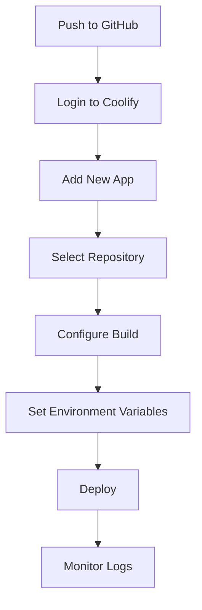
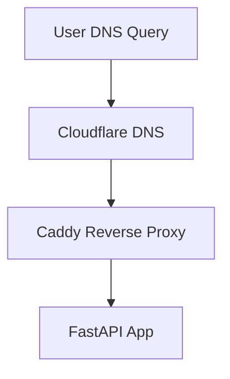

# Deployment and Production Tutorial

Welcome to the deployment and production tutorial! This guide will teach you how to take your FastAPI application from development to production, ensuring it's secure, scalable, and reliable.

---

## 🚦 What You Need (Production Checklist)

✅ A VPS like Hetzner, DigitalOcean, or AWS EC2  
✅ [Coolify](https://coolify.io/docs/) installed (or another PaaS)  
✅ Your repo pushed to GitHub  
✅ Domain managed via Cloudflare (recommended)  
✅ Docker and Docker Compose installed  
✅ A `.env.production` file with your secrets  

---

## What is Production Deployment?

Think of production deployment like opening a restaurant. You've been cooking in your kitchen (development), but now you need to:
- **Set up a proper restaurant** (production server)
- **Hire staff** (deploy your application)
- **Ensure food safety** (security measures)
- **Handle many customers** (scalability)
- **Monitor everything** (health checks and logging)

---

## Production File Structure

```
your-project/
├── .env.production          # Production secrets (never commit)
├── docker-compose.yml       # Production services
├── Dockerfile              # App container definition
├── requirements.txt        # Python dependencies
├── alembic/               # Database migrations
├── app/                   # Your FastAPI application
└── scripts/               # Deployment utilities
```

---

## Example .env.production

```env
ENVIRONMENT=production

# Database (compose services use these)
POSTGRES_DB=prod_db
POSTGRES_USER=prod_user
POSTGRES_PASSWORD=super-secure-password
POSTGRES_PORT=5432

# Optional: when using pgBouncer set DB_HOST=pgbouncer, otherwise leave as postgres
DB_HOST=postgres

# App connection URL (can leverage variables above)
DATABASE_URL=postgresql://${POSTGRES_USER}:${POSTGRES_PASSWORD}@${DB_HOST}:${POSTGRES_PORT}/${POSTGRES_DB}

SECRET_KEY=your-super-secure-production-secret-key
ACCESS_TOKEN_EXPIRE_MINUTES=15
REFRESH_TOKEN_EXPIRE_DAYS=30

SMTP_HOST=smtp.gmail.com
SMTP_PORT=587
SMTP_USERNAME=your-production-email@gmail.com
SMTP_PASSWORD=your-app-password
SMTP_TLS=True

ENABLE_RATE_LIMITING=true
RATE_LIMIT_DEFAULT=100/minute
RATE_LIMIT_LOGIN=5/minute
RATE_LIMIT_REGISTER=3/minute

ENABLE_REDIS=true
REDIS_URL=redis://prod-redis:6379/0

ENABLE_SENTRY=true
SENTRY_DSN=your-sentry-dsn
SENTRY_ENVIRONMENT=production

# CORS (set to your production domain(s))
CORS_ORIGINS=https://yourdomain.com
```

---

## Example docker-compose.yml (Production)

```yaml
version: '3.8'
services:
  postgres:
    image: postgres:15
    container_name: ${COMPOSE_PROJECT_NAME:-fast-api-template}-postgres-1
    environment:
      POSTGRES_DB: ${POSTGRES_DB}
      POSTGRES_USER: ${POSTGRES_USER}
      POSTGRES_PASSWORD: ${POSTGRES_PASSWORD}
    # Expose only if you need external DB access
    # ports:
    #   - "${POSTGRES_PORT}:5432"
    volumes:
      - postgres_data:/var/lib/postgresql/data
    networks:
      - app-network
    restart: unless-stopped
    healthcheck:
      test: ["CMD-SHELL", "pg_isready -U ${POSTGRES_USER} -d ${POSTGRES_DB}"]
      interval: 10s
      timeout: 5s
      retries: 5

  # pgBouncer for connection pooling (optional)
  pgbouncer:
    image: edoburu/pgbouncer:1.18.0
    container_name: ${COMPOSE_PROJECT_NAME:-fast-api-template}-pgbouncer-1
    environment:
      DATABASES_HOST: postgres
      DATABASES_PORT: 5432
      DATABASES_DBNAME: ${POSTGRES_DB}
      DATABASES_USER: ${POSTGRES_USER}
      DATABASES_PASSWORD: ${POSTGRES_PASSWORD}
      PGBOUNCER_PORT: 5432
      PGBOUNCER_POOL_MODE: transaction
      PGBOUNCER_MAX_CLIENT_CONN: 1000
      PGBOUNCER_DEFAULT_POOL_SIZE: 20
      PGBOUNCER_MAX_DB_CONNECTIONS: 50
      PGBOUNCER_MAX_USER_CONNECTIONS: 50
    # Expose only if you need to access pgBouncer from host
    # ports:
    #   - "${PGBOUNCER_PORT:-5433}:5432"
    depends_on:
      - postgres
    networks:
      - app-network
    restart: unless-stopped
    profiles:
      - pgbouncer  # Only start when explicitly requested

  # Optional Redis service - only used when ENABLE_REDIS=true
  redis:
    image: redis:7-alpine
    container_name: ${COMPOSE_PROJECT_NAME:-fast-api-template}-redis-1
    # Expose only if you need Redis from host
    # ports:
    #   - "${REDIS_PORT:-6379}:6379"
    volumes:
      - redis_data:/data
    networks:
      - app-network
    restart: unless-stopped
    profiles:
      - redis  # Only start when explicitly requested

  api:
    build:
      context: .
      dockerfile: Dockerfile
    container_name: ${COMPOSE_PROJECT_NAME:-fast-api-template}-api-1
    environment:
      DATABASE_URL: postgresql://${POSTGRES_USER}:${POSTGRES_PASSWORD}@${DB_HOST:-postgres}:${POSTGRES_PORT:-5432}/${POSTGRES_DB}
      REDIS_URL: redis://redis:6379/0
      SECRET_KEY: ${SECRET_KEY}
      ACCESS_TOKEN_EXPIRE_MINUTES: ${ACCESS_TOKEN_EXPIRE_MINUTES}
      ENABLE_REDIS: ${ENABLE_REDIS:-false}
      ENABLE_WEBSOCKETS: ${ENABLE_WEBSOCKETS:-false}
      ENABLE_CELERY: ${ENABLE_CELERY:-false}
      CELERY_BROKER_URL: redis://redis:6379/1
      CELERY_RESULT_BACKEND: redis://redis:6379/1
      ENABLE_SENTRY: ${ENABLE_SENTRY:-false}
      SENTRY_DSN: ${SENTRY_DSN:-}
      SENTRY_ENVIRONMENT: ${SENTRY_ENVIRONMENT:-production}
      WEB_CONCURRENCY: ${WEB_CONCURRENCY:-2}  # Rule of thumb: start with 2–4 workers, then tune under load
    # Do not publish the API port when using a reverse proxy container (e.g., Caddy)
    # ports:
    #   - "${API_PORT}:8000"
    depends_on:
      postgres:
        condition: service_healthy
    networks:
      - app-network
    restart: unless-stopped
    read_only: true
    healthcheck:
      test: ["CMD-SHELL", "wget -qO- http://localhost:8000/system/health/simple >/dev/null || exit 1"]
      interval: 10s
      timeout: 5s
      retries: 5
    command: /bin/sh -c "alembic upgrade head && exec gunicorn -k uvicorn.workers.UvicornWorker app.main:app --workers ${WEB_CONCURRENCY:-2} --bind 0.0.0.0:8000 --timeout ${GUNICORN_TIMEOUT:-60}"

  # Optional Celery worker service - only used when ENABLE_CELERY=true
  celery-worker:
    build:
      context: .
      dockerfile: Dockerfile
    container_name: ${COMPOSE_PROJECT_NAME:-fast-api-template}-celery-worker-1
    environment:
      DATABASE_URL: postgresql://${POSTGRES_USER}:${POSTGRES_PASSWORD}@${DB_HOST:-postgres}:${POSTGRES_PORT:-5432}/${POSTGRES_DB}
      REDIS_URL: redis://redis:6379/0
      SECRET_KEY: ${SECRET_KEY}
      ACCESS_TOKEN_EXPIRE_MINUTES: ${ACCESS_TOKEN_EXPIRE_MINUTES}
      ENABLE_REDIS: ${ENABLE_REDIS:-false}
      ENABLE_WEBSOCKETS: ${ENABLE_WEBSOCKETS:-false}
      ENABLE_CELERY: ${ENABLE_CELERY:-false}
      CELERY_BROKER_URL: redis://redis:6379/1
      CELERY_RESULT_BACKEND: redis://redis:6379/1
    depends_on:
      - postgres
      - redis
    networks:
      - app-network
    restart: unless-stopped
    command: celery -A app.services.celery worker --loglevel=info
    profiles:
      - celery  # Only start when explicitly requested

  # Optional Flower monitoring service - only used when ENABLE_CELERY=true
  flower:
    build:
      context: .
      dockerfile: Dockerfile
    container_name: ${COMPOSE_PROJECT_NAME:-fast-api-template}-flower-1
    environment:
      DATABASE_URL: postgresql://${POSTGRES_USER}:${POSTGRES_PASSWORD}@${DB_HOST:-postgres}:${POSTGRES_PORT:-5432}/${POSTGRES_DB}
      REDIS_URL: redis://redis:6379/0
      SECRET_KEY: ${SECRET_KEY}
      ACCESS_TOKEN_EXPIRE_MINUTES: ${ACCESS_TOKEN_EXPIRE_MINUTES}
      ENABLE_REDIS: ${ENABLE_REDIS:-false}
      ENABLE_WEBSOCKETS: ${ENABLE_WEBSOCKETS:-false}
      ENABLE_CELERY: ${ENABLE_CELERY:-false}
      CELERY_BROKER_URL: redis://redis:6379/1
      CELERY_RESULT_BACKEND: redis://redis:6379/1
    # Expose only if you need access from host
    # ports:
    #   - "${FLOWER_PORT:-5555}:5555"
    depends_on:
      - postgres
      - redis
    networks:
      - app-network
    restart: unless-stopped
    command: celery -A app.services.celery flower --port=5555
    profiles:
      - celery  # Only start when explicitly requested

  # Optional GlitchTip error monitoring service
  glitchtip:
    image: glitchtip/glitchtip:latest
    container_name: ${COMPOSE_PROJECT_NAME:-fast-api-template}-glitchtip-1
    environment:
      - DJANGO_SETTINGS_MODULE=glitchtip.settings.production
      - GLITCHTIP_SECRET_KEY=${GLITCHTIP_SECRET_KEY:-your-secret-key-here}
      - GLITCHTIP_DB_ENGINE=django.db.backends.postgresql
      - GLITCHTIP_DB_NAME=${POSTGRES_DB}
      - GLITCHTIP_DB_USER=${POSTGRES_USER}
      - GLITCHTIP_DB_PASSWORD=${POSTGRES_PASSWORD}
      - GLITCHTIP_DB_HOST=postgres
      - GLITCHTIP_DB_PORT=5432
      - GLITCHTIP_REDIS_URL=redis://redis:6379/0
      - GLITCHTIP_EMAIL_BACKEND=django.core.mail.backends.console.EmailBackend
    # Expose only if you need access from host
    # ports:
    #   - "${GLITCHTIP_PORT:-8001}:8000"
    depends_on:
      - postgres
      - redis
    networks:
      - app-network
    restart: unless-stopped
    profiles:
      - monitoring  # Only start when explicitly requested

volumes:
  postgres_data:
    name: ${COMPOSE_PROJECT_NAME:-fast-api-template}-postgres_data
  redis_data:
    name: ${COMPOSE_PROJECT_NAME:-fast-api-template}-redis_data

networks:
  app-network:
    name: ${COMPOSE_PROJECT_NAME:-fast-api-template}-app-network
    driver: bridge
```

> **Important:** Make sure the `POSTGRES_DB`, `POSTGRES_USER`, and `POSTGRES_PASSWORD` values in your `.env.production` file match what you set in `docker-compose.yml`. If they don't match, your app will not be able to connect to the database. If you enable pgBouncer, set `DB_HOST=pgbouncer` so the app connects through the pooler.

---

## Production Settings (What to Check)

- `ENVIRONMENT=production`
- `SECRET_KEY` is strong and unique (use `openssl rand -hex 32`)
- `DATABASE_URL` points to your production DB
- `ENABLE_RATE_LIMITING=true`
- `ENABLE_REDIS=true` (if using Redis)
- `ENABLE_SENTRY=true` (if using Sentry/GlitchTip)
- All email and OAuth credentials are set for production
- CORS is restricted to your production domains
- `SENTRY_ENVIRONMENT=production`

### Security Hardening

- Run containers as a non-root user (Dockerfile already creates and uses `app`)
- Avoid publishing database/redis/api ports to the host; expose only the reverse proxy (e.g., Caddy)
- Enable Cloudflare SSL/TLS "Full (Strict)" mode for end-to-end encryption
- Use app-specific passwords for SMTP where possible
- Rotate `SECRET_KEY` only when also rotating tokens/sessions that depend on it

---

## Deploying with Coolify (Step-by-Step)



### Coolify Deployment Flow

1. **Push your code to GitHub**
2. **Log in to your Coolify dashboard**
3. **Click "Add New App"**
4. **Select your GitHub repo**
5. **Set build and run commands** (e.g., `docker compose up -d`)
6. **Add environment variables** (copy from `.env.production`)
7. **Deploy!**

> **Migrations Note:** By default, Coolify does NOT run database migrations automatically. After your app is deployed, you must run migrations manually (e.g., via the Coolify web terminal or SSH):
> ```bash
> docker compose exec api alembic upgrade head
> ```
> To automate this, configure the `api` service command to run `alembic upgrade head` before starting the server (as shown in the compose example).

> For more, see [Coolify's official docs](https://coolify.io/docs/).

---

## Caddy + Cloudflare Setup (for HTTPS & Proxy)

**Caddyfile Example:**

```
yourdomain.com {
  reverse_proxy api:8000
  tls {
    dns cloudflare {env.CLOUDFLARE_API_TOKEN}
  }
}
```

If you run Caddy directly on the host (not in Docker), point it to `localhost:8000` and publish the API port in compose.

> Cloudflare DNS challenge note: The Caddy image must include the Cloudflare DNS plugin. If you use Docker, build with `xcaddy` or use an image that bundles the module. See: https://caddyserver.com/docs/build#xcaddy

- [Caddy Cloudflare DNS Docs](https://caddyserver.com/docs/automatic-https#dns-provider)
- [Cloudflare API Tokens](https://developers.cloudflare.com/api/tokens/create/)

**Architecture Overview:**



**Steps:**
1. Get a Cloudflare API token with DNS edit permissions
2. Set `CLOUDFLARE_API_TOKEN` in your environment
3. Use the above Caddyfile to enable HTTPS and proxy to your app

### Running Caddy in Docker vs on host

- In Docker: mount your `Caddyfile` and attach Caddy to the same `app-network`, then point to `api:8000`.
- On host: expose the API port and point to `localhost:8000`.

Expose API (host mode) example:
```yaml
services:
  api:
    ports:
      - "8000:8000"
```

---

## Where to Put Files

- Place `.env.production` in your project root (never commit to git)
- Place `docker-compose.yml` in your project root
- Place `Caddyfile` in your server's home directory (or wherever Caddy runs)

---

## Quick Reference: Deploying

1. **Build and run Docker containers:**
    ```bash
    docker-compose -f docker-compose.yml up -d
    ```
2. **Run migrations:**
    ```bash
    docker-compose exec api alembic upgrade head
    ```
3. **Create a superuser:**
    ```bash
    docker-compose exec api python app/bootstrap_superuser.py
    ```
4. **Set up Caddy for HTTPS**
5. **Point your domain to your server's IP in Cloudflare**

---

## How to use this in production (no extra files)

Use the production compose example above directly with your existing `docker-compose.yml` by passing your `.env.production` at runtime and only enabling the services you need.

1) Prepare environment
```bash
cp .env.production.example .env.production   # if you have an example; otherwise create .env.production
vim .env.production                           # set POSTGRES_*, DB_HOST, SECRET_KEY, etc.
```

2) Bring up the core stack (Postgres + API)
```bash
docker compose --env-file ./.env.production up -d postgres api
```

3) Optional profiles
```bash
# Enable Redis
docker compose --env-file ./.env.production --profile redis up -d redis

# Enable Celery worker and Flower
docker compose --env-file ./.env.production --profile celery up -d celery-worker flower

# Enable pgBouncer (then set DB_HOST=pgbouncer and restart api)
docker compose --env-file ./.env.production --profile pgbouncer up -d pgbouncer
docker compose --env-file ./.env.production restart api
```

4) Migrations (if not using the automated command)
```bash
docker compose --env-file ./.env.production exec api alembic upgrade head
```

Alembic migrations are idempotent: running `upgrade head` on each container start is safe and ensures the DB schema is current.

5) Caddy reverse proxy
- If Caddy runs in Docker with the app: point to `api:8000` in your `Caddyfile`.
- If Caddy runs on the host: publish the API port and point to `localhost:8000`.

6) Coolify
- Use the same repo and `docker-compose.yml`.
- Set environment using the contents of `.env.production` in Coolify.
- Run command: `docker compose up -d`.
- If needed, add a post-deploy command: `docker compose exec api alembic upgrade head` (or rely on the `command:` that already runs migrations in the example).

Notes
- The tutorial’s compose block is production-safe (no `--reload`, no dev volume mounts, read-only root fs, gunicorn workers, healthchecks).
- Ensure `SECRET_KEY` is strong and CORS is locked down to your domain(s).

---

## Optional Services

### **pgBouncer (Connection Pooling)**
```bash
# Start with pgBouncer
docker compose --profile pgbouncer up -d
```

Auth note: Some setups require configuring credentials for pgBouncer. Ensure your users match and authentication works (e.g., via `userlist.txt` or environment-driven auth settings). If using SCRAM, configure the appropriate auth type (e.g., `AUTH_TYPE=scram-sha-256`) for your image.

### **Redis (Caching & Sessions)**
```bash
# Start with Redis
docker compose --profile redis up -d
```

### **Celery (Background Tasks)**
```bash
# Start with Celery worker and Flower monitoring
docker compose --profile celery up -d
```

### **GlitchTip (Error Monitoring)**
```bash
# Start with GlitchTip monitoring
docker compose --profile monitoring up -d
```

---

## Useful Tools & Links

### Database Management
- **[pgAdmin](https://www.pgadmin.org/)**: Web-based PostgreSQL admin tool
- **[Beekeeper Studio](https://www.beekeeperstudio.io/)**: Modern SQL editor and database manager
- **[DBeaver](https://dbeaver.io/)**: Universal database tool

### Monitoring & Logs

Logs go to stdout by default. View them via Coolify or:
```bash
docker compose logs -f api
```

- **[Coolify Docs](https://coolify.io/docs/)**: Self-hosted PaaS platform
- **[Caddy Docs](https://caddyserver.com/docs/)**: Modern web server with automatic HTTPS
- **[Cloudflare Docs](https://developers.cloudflare.com/)**: CDN and DNS management

### Development Tools
- **[Docker Compose](https://docs.docker.com/compose/)**: Multi-container Docker applications
- **[GitHub Actions](https://docs.github.com/en/actions)**: CI/CD automation

---

## Troubleshooting

- **App won't start?** Check environment variables and logs
- **Database connection errors?** Check `DATABASE_URL` and DB status
- **HTTPS not working?** Check Caddy and Cloudflare DNS settings
- **Email not sending?** Check SMTP credentials
- **Docs page blank?** The template serves a custom Swagger UI at `/docs` with CDN fallbacks and a CSP relaxed only for docs. If your network blocks CDNs, either allowlist `unpkg.com` and `cdnjs.cloudflare.com` for the `/docs` route, or host Swagger UI assets locally by editing `app/main.py`. A quick refresh after startup often resolves initial load timing.

---

## Glossary

- **VPS**: Virtual Private Server, a virtualized server hosted by a cloud provider.
- **PaaS**: Platform as a Service, a cloud computing model that provides a platform for developing and deploying applications.
- **CI/CD**: Continuous Integration/Continuous Deployment, automated processes for building, testing, and deploying code.
- **DNS**: Domain Name System, translates domain names to IP addresses.
- **CDN**: Content Delivery Network, distributes content across multiple servers worldwide for faster access.
- **SSL/TLS**: Security protocols for encrypting data transmitted over the internet.

---

## Next Steps

Now that you understand production deployment, you can:
1. **Choose your deployment platform** (Coolify, Heroku, AWS, GCP, etc.)
2. **Set up monitoring and alerting** for your application
3. **Implement automated backups** for data safety
4. **Configure CI/CD pipelines** for automated deployments
5. **Set up staging environments** for testing before production

Remember: Production deployment is about reliability, security, and scalability. Start simple and add complexity as your application grows! 