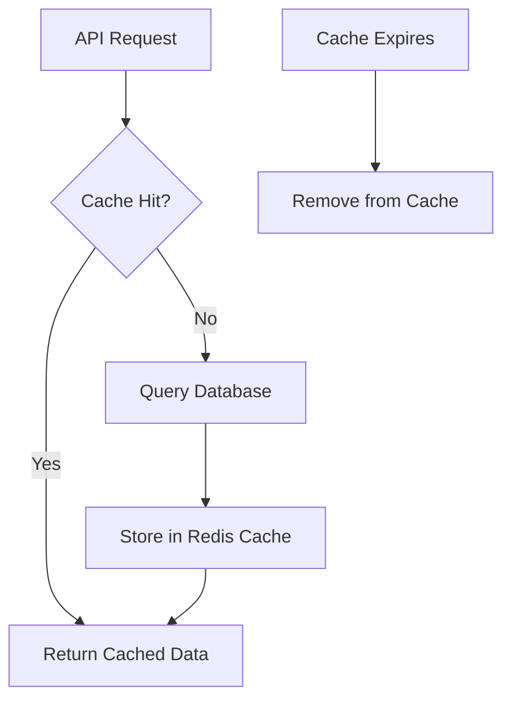

# Optional Features Tutorial

Welcome to the optional features tutorial! This guide will teach you about the advanced features that can make your FastAPI application faster, more interactive, and more powerful.

---

## What are Optional Features?

Think of optional features like add-ons for your car. The basic car works great, but you can add:
- **Redis**: Caching and session storage for better performance
- **WebSockets**: Real-time communication for live features
- **Celery**: Background task processing for heavy operations
- **Email**: Automated email sending for user management
- **Admin CLI**: Terminal-based administration tools

---

## 🚀 Quick Feature Overview

| Feature | Enable With | Purpose | Complexity |
|---------|-------------|---------|------------|
| **Redis** | `ENABLE_REDIS=true` | Caching & sessions | Easy |
| **WebSockets** | `ENABLE_WEBSOCKETS=true` | Real-time features | Medium |
| **Celery** | `ENABLE_CELERY=true` | Background tasks | Medium |
| **Email** | SMTP settings | User notifications | Easy |
| **Admin CLI** | CLI scripts | Terminal admin | Easy |

---

## 🔄 Redis - Caching & Sessions

**One-liner**: Redis is used for caching and fast in-memory data storage.

**Why use it**: Speeds up your app by storing frequently accessed data in memory instead of hitting the database every time.

**Relevant code**: [`app/services/redis.py`](../../app/services/redis.py)

### How to Enable Redis

1. **Add to `.env` file:**
   ```env
   ENABLE_REDIS=true
   REDIS_URL=redis://localhost:6379/0
   ```

2. **Start Redis with Docker:**
   ```bash
   docker-compose up -d redis
   ```

3. **Restart your FastAPI server:**
   ```bash
   uvicorn app.main:app --reload
   ```

### Redis Lifecycle Flow



### What Redis Does

- **Session Storage**: Keeps user sessions in memory
- **Rate Limiting**: Tracks API usage for security
- **Caching**: Stores frequently accessed data
- **Background Tasks**: Queues tasks for Celery workers

> **Redis Roles Explained:**
> - **Rate Limiting**: Tracks how many requests each user makes, preventing abuse.
> - **Caching**: Stores API responses or computed data for fast retrieval.
> - **Sessions**: Maintains user login sessions for quick access.
>
> **Tradeoff:** Redis is extremely fast, but data is stored in memory (RAM). If Redis restarts, cached/session data is lost unless persistence is enabled. For critical data, always store in your main database.

### Test Redis

```bash
# Check if Redis is working
curl http://localhost:8000/health

# Look for this in the response:
{
  "status": "healthy",
  "redis": "healthy",
  "database": "healthy"
}
```

---

## 📡 WebSockets - Real-Time Communication

**One-liner**: WebSockets provide real-time, bidirectional communication between client and server.

**Why use it**: Enable live chat, notifications, dashboards, and any feature that needs instant updates.

**Relevant code**: [`app/api/api_v1/endpoints/ws_demo.py`](../../app/api/api_v1/endpoints/ws_demo.py)

### How to Enable WebSockets

1. **Add to `.env` file:**
   ```env
   ENABLE_WEBSOCKETS=true
   ```

2. **Restart your FastAPI server:**
   ```bash
   uvicorn app.main:app --reload
   ```

3. **Connect to WebSocket endpoint:**
   ```
   ws://localhost:8000/api/v1/ws/chat/{room_name}?token={access_token}
   ```

### WebSocket Features

- **Room-based Chat**: Join different chat rooms
- **Real-time Messaging**: Instant message delivery
- **User Presence**: See who's online
- **Broadcast Messages**: Send to all users in a room

### Test WebSockets

```bash
# Install websocat (if not already installed)
# macOS: brew install websocat
# Linux: sudo apt install websocat

# Connect to chat room (replace with your access token)
websocat ws://localhost:8000/api/v1/ws/chat/test-room?token=your_access_token

# Send a message
{"message": "Hello, WebSocket!"}
```

---

## 🦾 Celery - Background Tasks

**One-liner**: Celery is used for background task processing, handling heavy operations without blocking your API.

**Why use it**: Process emails, generate reports, handle file uploads, and other time-consuming tasks in the background.

**Relevant code**: 
- [`app/services/celery_app.py`](../../app/services/celery_app.py)
- [`app/services/celery_tasks.py`](../../app/services/celery_tasks.py)

### How to Enable Celery

1. **Add to `.env` file:**
   ```env
   ENABLE_CELERY=true
   CELERY_BROKER_URL=redis://localhost:6379/1
   ```

2. **Start Redis (if not already running):**
   ```bash
   docker-compose up -d redis
   ```

3. **Start Celery worker:**
   ```bash
   celery -A app.services.celery_app worker --loglevel=info
   ```

4. **Restart your FastAPI server:**
   ```bash
   uvicorn app.main:app --reload
   ```

### Celery Task Lifecycle

```mermaid
flowchart TD
  A[User Action] --> B[API Endpoint]
  B --> C[Task Queued in Redis]
  C --> D[Celery Worker Picks Up Task]
  D --> E[Task Processing]
  E --> F[Result Stored]
  F --> G[User Notified (Optional)]
```

### Example Celery Task

See [`send_email()` in app/services/email.py`](../../app/services/email.py) for the full implementation. Example Celery tasks are provided in [`app/services/celery_tasks.py`](../../app/services/celery_tasks.py).

@shared_task
def send_welcome_email(user_email: str, username: str):
    """Send welcome email to new user."""
    subject = f"Welcome to our app, {username}!"
    message = f"""
    Hi {username},
    
    Welcome to our FastAPI application! We're excited to have you on board.
    
    Best regards,
    The Team
    """
    
    send_email(user_email, subject, message)
    return f"Welcome email sent to {username}"

@shared_task
def process_user_data(user_id: int):
    """Process user data in the background."""
    # Simulate heavy processing
    import time
    time.sleep(10)
    return f"Processed data for user {user_id}"
```

### Test Celery

```bash
# Submit a test task via API
curl -X POST "http://localhost:8000/api/v1/celery/test-task" \
  -H "Authorization: Bearer YOUR_ACCESS_TOKEN" \
  -H "Content-Type: application/json" \
  -d '{"message": "Hello from Celery!"}'

# Check task status
curl -X GET "http://localhost:8000/api/v1/celery/task-status/{task_id}"
```

---

## 📧 Email - Automated Notifications

**One-liner**: Email is used for password resets, account verification, and user notifications.

**Why use it**: Keep users informed and provide essential account management features.

**Relevant code**: [`app/services/email.py`](../../app/services/email.py)

### How to Enable Email

1. **Add SMTP settings to `.env` file:**
   ```env
   SMTP_HOST=smtp.gmail.com
   SMTP_PORT=587
   SMTP_USER=your-email@gmail.com
   SMTP_PASSWORD=your-app-password
   SMTP_TLS=True
   ```

2. **Restart your FastAPI server:**
   ```bash
   uvicorn app.main:app --reload
   ```

### Email Features

- **Account Verification**: Verify new user emails
- **Password Reset**: Send secure reset links
- **Account Deletion**: Confirm deletion requests
- **Welcome Emails**: Greet new users

### Test Email

```bash
# Register a new user (should trigger verification email)
curl -X POST "http://localhost:8000/api/v1/auth/register" \
  -H "Content-Type: application/json" \
  -d '{
    "email": "test@example.com",
    "username": "testuser",
    "password": "TestPassword123!"
  }'

# Check your email for the verification link
```

---

## 🛠️ Admin CLI - Terminal Administration

**One-liner**: Admin CLI lets you manage users and view statistics from the terminal.

**Why use it**: Quick administration tasks without needing a web interface.

**Relevant code**: [`scripts/admin_cli.py`](../../scripts/admin_cli.py)

### How to Use Admin CLI

1. **Make the script executable:**
   ```bash
   chmod +x scripts/admin_cli.sh
   ```

2. **Run admin commands:**
   ```bash
   # Show help
   python scripts/admin_cli.py --help

   # List all users
   python scripts/admin_cli.py list-users

   # Create a superuser
   python scripts/admin_cli.py create-superuser

   # Show statistics
   python scripts/admin_cli.py stats
   ```

> **Note:** If the CLI script cannot connect to the database (e.g., DB is down or credentials are wrong), it will fail with a connection error. Always ensure your database is running and your `.env` settings are correct before running CLI commands.

### Available Commands

- `list-users`: Show all users in the system
- `create-superuser`: Create an admin user
- `stats`: Show system statistics
- `delete-user`: Remove a user account
- `verify-user`: Manually verify a user's email

### Test Admin CLI

```bash
# Create a superuser
python scripts/admin_cli.py create-superuser

# List all users
python scripts/admin_cli.py list-users

# Show system stats
python scripts/admin_cli.py stats
```

---

## 🔧 Feature Configuration Summary

| Feature | Environment Variable | Dependencies | Command to Start |
|---------|---------------------|--------------|------------------|
| **Redis** | `ENABLE_REDIS=true` | Docker | `docker-compose up -d redis` |
| **WebSockets** | `ENABLE_WEBSOCKETS=true` | None | Restart server |
| **Celery** | `ENABLE_CELERY=true` | Redis | `celery -A app.services.celery_app worker` |
| **Email** | SMTP settings | None | Restart server |
| **Admin CLI** | None | None | `python scripts/admin_cli.py` |

---

## 🧪 Testing All Features

### Quick Health Check

```bash
# Check all services are running
curl http://localhost:8000/health

# Expected response:
{
  "status": "healthy",
  "database": "healthy",
  "redis": "healthy",
  "celery": "healthy"
}
```

### Feature-Specific Tests

```bash
# Test Redis caching
curl http://localhost:8000/api/v1/users?page=1&size=10

# Test WebSockets
websocat ws://localhost:8000/api/v1/ws/chat/test-room?token=your_token

# Test Celery
curl -X POST "http://localhost:8000/api/v1/celery/test-task" \
  -H "Authorization: Bearer YOUR_TOKEN"

# Test Email
curl -X POST "http://localhost:8000/api/v1/auth/register" \
  -H "Content-Type: application/json" \
  -d '{"email": "test@example.com", "username": "test", "password": "Test123!"}'

# Test Admin CLI
python scripts/admin_cli.py stats
```

---

## 🚨 Troubleshooting

### Redis Issues
- **Connection refused**: Make sure Redis is running (`docker-compose up -d redis`)
- **Authentication error**: Check `REDIS_URL` in `.env`

### WebSocket Issues
- **Connection failed**: Verify `ENABLE_WEBSOCKETS=true` and restart server
- **Authentication error**: Make sure you're using a valid access token

### Celery Issues
- **Worker not starting**: Check `CELERY_BROKER_URL` and ensure Redis is running
- **Tasks not processing**: Verify worker is running with `celery -A app.services.celery_app worker`

### Email Issues
- **SMTP error**: Check SMTP credentials and enable "Less secure app access" for Gmail
- **No emails sent**: Verify SMTP settings in `.env`

---

## Glossary

- **Redis**: An in-memory data structure store used for caching, sessions, and message brokering.
- **WebSocket**: A communication protocol that provides full-duplex communication channels over a single TCP connection.
- **Celery**: A distributed task queue system that can process vast amounts of messages.
- **SMTP**: Simple Mail Transfer Protocol, used for sending emails.
- **CLI**: Command Line Interface, a text-based interface for interacting with software.
- **Broker**: A message broker (like Redis) that stores and forwards messages between applications.
- **Worker**: A Celery process that executes background tasks.

---

## Next Steps

Now that you understand optional features, you can:
1. **Choose which features to enable** based on your app's needs
2. **Optimize performance** with Redis caching
3. **Add real-time features** with WebSockets
4. **Handle background tasks** with Celery
5. **Automate user management** with email notifications
6. **Manage your app** efficiently with the Admin CLI

Remember: Start simple and add features as you need them. The template works great without any optional features, but they can make your app much more powerful when used appropriately! 