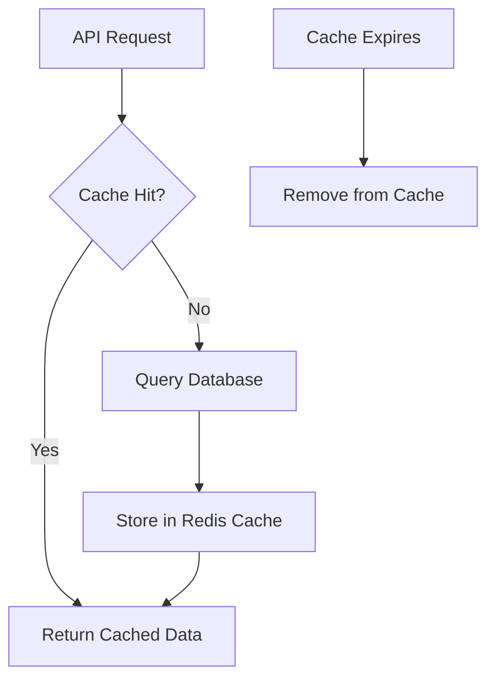
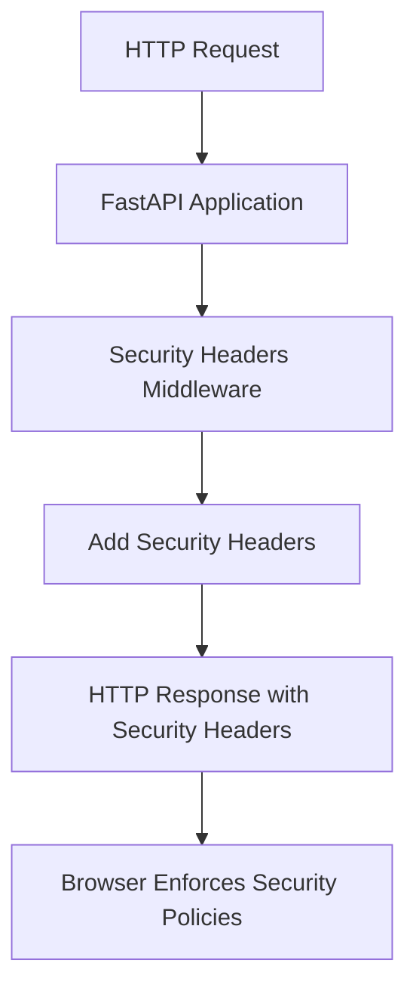
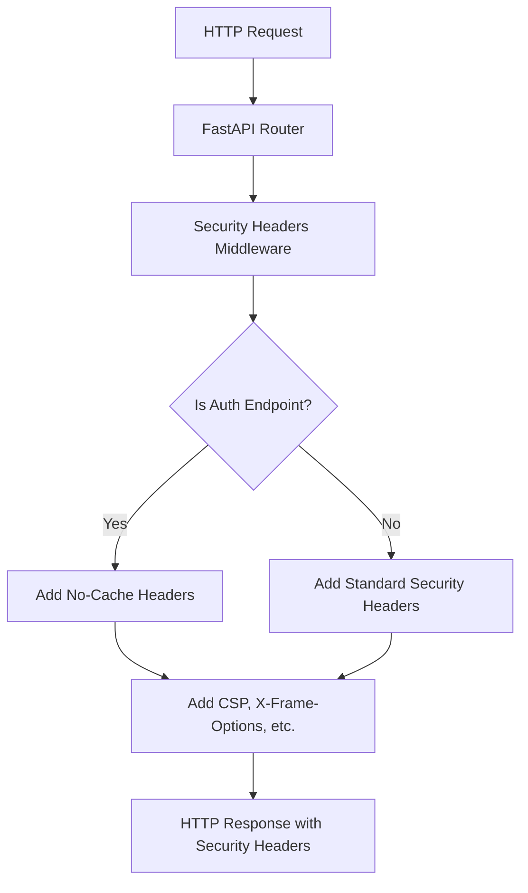

# Optional Features Tutorial

Welcome to the optional features tutorial! This guide will teach you about the advanced features that can make your FastAPI application faster, more interactive, and more powerful.

---

## What are Optional Features?

Think of optional features like add-ons for your car. The basic car works great, but you can add:
- **Redis**: Caching and session storage for better performance
- **WebSockets**: Real-time communication for live features
- **Celery**: Background task processing for heavy operations
- **Email**: Automated email sending for user management
- **Admin CLI**: Terminal-based administration tools
- **Security Headers**: HTTP security protection

---

## 🚀 Quick Feature Overview

| Feature | Enable With | Purpose | Complexity |
|---------|-------------|---------|------------|
| **Redis** | `ENABLE_REDIS=true` | Caching & sessions | Easy |
| **WebSockets** | `ENABLE_WEBSOCKETS=true` | Real-time features | Medium |
| **Celery** | `ENABLE_CELERY=true` | Background tasks | Medium |
| **Email** | SMTP settings | User notifications | Easy |
| **Admin CLI** | CLI scripts | Terminal admin | Easy |
| **Security Headers** | `ENABLE_SECURITY_HEADERS=true` | HTTP security headers | Easy |

---

## 🔄 Redis - Caching & Sessions

**One-liner**: Redis is used for caching and fast in-memory data storage.

**Why use it**: Speeds up your app by storing frequently accessed data in memory instead of hitting the database every time.

**Relevant code**: [`app/services/external/redis.py`](../../app/services/external/redis.py)

### How to Enable Redis

1. **Add to `.env` file:**
   ```env
   ENABLE_REDIS=true
   REDIS_URL=redis://localhost:6379/0
   ```

2. **Start Redis with Docker:**
   ```bash
   docker-compose up -d redis
   ```

3. **Restart your FastAPI server:**
   ```bash
   docker-compose restart api
   ```

### Redis Lifecycle Flow



### What Redis Does

- **Session Storage**: Keeps user sessions in memory
- **Rate Limiting**: Tracks API usage for security
- **Caching**: Stores frequently accessed data
- **Background Tasks**: Queues tasks for Celery workers

> **Redis Roles Explained:**
> - **Rate Limiting**: Tracks how many requests each user makes, preventing abuse.
> - **Caching**: Stores API responses or computed data for fast retrieval.
> - **Sessions**: Maintains user login sessions for quick access.
>
> **Tradeoff:** Redis is extremely fast, but data is stored in memory (RAM). If Redis restarts, cached/session data is lost unless persistence is enabled. For critical data, always store in your main database.

### Test Redis

```bash
# Check if Redis is working
curl http://localhost:8000/system/health

# Look for this in the response:
{
  "status": "healthy",
  "redis": "healthy",
  "database": "healthy"
}
```

---

## 📡 WebSockets - Real-Time Communication

**One-liner**: WebSockets provide real-time, bidirectional communication between client and server.

**Why use it**: Enable live chat, notifications, dashboards, and any feature that needs instant updates.

**Relevant code**: [`app/api/integrations/websockets.py`](../../app/api/integrations/websockets.py)

### How to Enable WebSockets

1. **Add to `.env` file:**
   ```env
   ENABLE_WEBSOCKETS=true
   ```

2. **Restart your FastAPI server:**
   ```bash
   docker-compose restart api
   ```

3. **Connect to WebSocket endpoint:**
   ```
   ws://localhost:8000/integrations/ws/demo
   ```

### WebSocket Features

- **Demo Endpoint**: Test WebSocket functionality
- **Real-time Messaging**: Instant message delivery
- **Room-based Chat**: Join different chat rooms
- **Broadcast Messages**: Send to all users in a room
- **Connection Management**: Automatic connection handling

### Test WebSockets

```bash
# Install websocat (if not already installed)
# macOS: brew install websocat
# Linux: sudo apt install websocat

# Connect to demo WebSocket
websocat ws://localhost:8000/integrations/ws/demo

# Send a message
{"type": "echo", "message": "Hello, WebSocket!"}

# Join a room
{"type": "room", "room": "test-room"}

# Broadcast to room
{"type": "room_broadcast", "message": "Hello room!", "room": "test-room"}
```

---

## 🦾 Celery - Background Tasks

**One-liner**: Celery is used for background task processing, handling heavy operations without blocking your API.

**Why use it**: Process emails, generate reports, handle file uploads, and other time-consuming tasks in the background.

**Relevant code**: 
- [`app/services/background/celery_app.py`](../../app/services/background/celery_app.py)
- [`app/services/background/celery_tasks.py`](../../app/services/background/celery_tasks.py)

### How to Enable Celery

1. **Add to `.env` file:**
   ```env
   ENABLE_CELERY=true
   CELERY_BROKER_URL=redis://localhost:6379/1
   ```

2. **Start Redis (if not already running):**
   ```bash
   docker-compose up -d redis
   ```

3. **Start Celery worker:**
   ```bash
   celery -A app.services.background.celery_app worker --loglevel=info
   ```

4. **Restart your FastAPI server:**
   ```bash
   docker-compose restart api
   ```

### Celery Task Lifecycle

```mermaid
flowchart TD
  A[User Action] --> B[API Endpoint]
  B --> C[Task Queued in Redis]
  C --> D[Celery Worker Picks Up Task]
  D --> E[Task Processing]
  E --> F[Result Stored]
  F --> G[User Notified (Optional)]
```

### Example Celery Tasks

The template includes several example tasks in [`app/services/background/celery_tasks.py`](../../app/services/background/celery_tasks.py):

```python
@celery_app.task(name="app.services.celery_tasks.send_email_task")
def send_email_task(to_email: str, subject: str, body: str) -> dict[str, Any]:
    """Send email via Celery task."""
    time.sleep(1)
    return {"status": "sent", "to": to_email, "subject": subject}

@celery_app.task(name="app.services.celery_tasks.process_data_task")
def process_data_task(data: list[dict[str, Any]]) -> dict[str, Any]:
    """Process data in background."""
    time.sleep(1)
    return {"status": "processed", "count": len(data)}

@celery_app.task(name="app.services.celery_tasks.permanently_delete_accounts_task")
def permanently_delete_accounts_task() -> dict[str, Any]:
    """Permanently delete accounts that have passed their grace period."""
    # Complex account deletion logic
    return {"status": "completed", "accounts_deleted": count}
```

### Test Celery

```bash
# Submit a test task via API
curl -X POST "http://localhost:8000/system/background-tasks/test-task" \
  -H "Authorization: Bearer YOUR_ACCESS_TOKEN" \
  -H "Content-Type: application/json" \
  -d '{"message": "Hello from Celery!"}'

# Check task status
curl -X GET "http://localhost:8000/system/background-tasks/task-status/{task_id}"
```

---

## 📧 Email - Automated Notifications

**One-liner**: Email is used for password resets, account verification, and user notifications.

**Why use it**: Keep users informed and provide essential account management features.

**Relevant code**: [`app/services/external/email.py`](../../app/services/external/email.py)

### How to Enable Email

1. **Add SMTP settings to `.env` file:**
   ```env
   SMTP_HOST=smtp.gmail.com
   SMTP_PORT=587
   SMTP_USERNAME=your-email@gmail.com
   SMTP_PASSWORD=your-app-password
   SMTP_TLS=True
   ```

2. **Restart your FastAPI server:**
   ```bash
   docker-compose restart api
   ```

### Email Features

- **Account Verification**: Verify new user emails
- **Password Reset**: Send secure reset links
- **Account Deletion**: Confirm deletion requests
- **Welcome Emails**: Greet new users

### Test Email

```bash
# Register a new user (should trigger verification email)
curl -X POST "http://localhost:8000/auth/register" \
  -H "Content-Type: application/json" \
  -d '{
    "email": "test@example.com",
    "username": "testuser",
    "password": "TestPassword123!"
  }'

# Check your email for the verification link
```

---

## 🛠️ Admin CLI - Terminal Administration

**One-liner**: Admin CLI lets you manage users and view statistics from the terminal.

**Why use it**: Quick administration tasks without needing a web interface.

**Relevant code**: [`scripts/admin/admin_cli.py`](../../scripts/admin/admin_cli.py)

### How to Use Admin CLI

1. **Make the script executable:**
   ```bash
   chmod +x scripts/admin/admin_cli.sh
   ```

2. **Run admin commands:**
   ```bash
   # Show help
   python scripts/admin/admin_cli.py --help

   # List all users
   python scripts/admin/admin_cli.py list-users

   # Create a superuser
   python scripts/admin/admin_cli.py create-superuser

   # Show statistics
   python scripts/admin/admin_cli.py stats
   ```

> **Note:** If the CLI script cannot connect to the database (e.g., DB is down or credentials are wrong), it will fail with a connection error. Always ensure your database is running and your `.env` settings are correct before running CLI commands.

### Available Commands

- `list-users`: Show all users in the system
- `create-superuser`: Create an admin user
- `stats`: Show system statistics
- `delete-user`: Remove a user account
- `verify-user`: Manually verify a user's email

### Test Admin CLI

```bash
# Create a superuser
python scripts/admin/admin_cli.py create-superuser

# List all users
python scripts/admin/admin_cli.py list-users

# Show system stats
python scripts/admin/admin_cli.py stats
```

---

## 🔧 Feature Configuration Summary

| Feature | Environment Variable | Dependencies | Command to Start |
|---------|---------------------|--------------|------------------|
| **Redis** | `ENABLE_REDIS=true` | Docker | `docker-compose up -d redis` |
| **WebSockets** | `ENABLE_WEBSOCKETS=true` | None | Restart server |
| **Celery** | `ENABLE_CELERY=true` | Redis | `celery -A app.services.background.celery_app worker` |
| **Email** | SMTP settings | None | Restart server |
| **Admin CLI** | None | None | `python scripts/admin/admin_cli.py` |
| **Security Headers** | `ENABLE_SECURITY_HEADERS=true` | None | Enabled by default |

---

## 🧪 Testing All Features

### Quick Health Check

```bash
# Check all services are running
curl http://localhost:8000/system/health

# Expected response:
{
  "status": "healthy",
  "database": "healthy",
  "redis": "healthy",
  "celery": "healthy"
}
```

### Feature-Specific Tests

```bash
# Test Redis caching
curl http://localhost:8000/users?page=1&size=10

# Test WebSockets
websocat ws://localhost:8000/integrations/ws/demo

# Test Celery
curl -X POST "http://localhost:8000/system/background-tasks/test-task" \
  -H "Authorization: Bearer YOUR_TOKEN"

# Test Email
curl -X POST "http://localhost:8000/auth/register" \
  -H "Content-Type: application/json" \
  -d '{"email": "test@example.com", "username": "test", "password": "Test123!"}'

# Test Admin CLI
python scripts/admin/admin_cli.py stats

# Test Security Headers
curl -I http://localhost:8000/
```

---

## 🚨 Troubleshooting

### Redis Issues
- **Connection refused**: Make sure Redis is running (`docker-compose up -d redis`)
- **Authentication error**: Check `REDIS_URL` in `.env`

### WebSocket Issues
- **Connection failed**: Verify `ENABLE_WEBSOCKETS=true` and restart server
- **Authentication error**: Make sure you're using a valid access token

### Celery Issues
- **Worker not starting**: Check `CELERY_BROKER_URL` and ensure Redis is running
- **Tasks not processing**: Verify worker is running with `celery -A app.services.background.celery_app worker`

### Email Issues
- **SMTP error**: Check SMTP credentials and enable "Less secure app access" for Gmail
- **No emails sent**: Verify SMTP settings in `.env`

---

## 🛡️ Security Headers - HTTP Security Protection

**One-liner**: Security headers protect your application from common web vulnerabilities by adding protective HTTP headers to all responses.

**Why use it**: Prevents XSS attacks, clickjacking, MIME type sniffing, and other security vulnerabilities that can compromise your application and users.

**Relevant code**: [`app/core/security/security_headers.py`](../../app/core/security/security_headers.py)

### How to Enable Security Headers

Security headers are **enabled by default** in this template. You can configure them in your `.env` file:

```env
# Security Headers (enabled by default)
ENABLE_SECURITY_HEADERS=true

# HSTS (only enable in production with HTTPS)
ENABLE_HSTS=false
HSTS_MAX_AGE=31536000
HSTS_INCLUDE_SUBDOMAINS=true
HSTS_PRELOAD=false
```

### Security Headers Lifecycle



### What Security Headers Do

- **Content Security Policy (CSP)**: Controls which resources can be loaded (scripts, styles, images)
- **X-Content-Type-Options**: Prevents MIME type sniffing attacks
- **X-Frame-Options**: Prevents clickjacking by controlling iframe embedding
- **X-XSS-Protection**: Enables browser's built-in XSS filtering
- **Referrer Policy**: Controls how much referrer information is sent with requests
- **Permissions Policy**: Restricts browser features like camera, microphone, geolocation
- **Strict Transport Security (HSTS)**: Forces HTTPS connections (production only)
- **X-Download-Options**: Prevents automatic file downloads
- **X-Permitted-Cross-Domain-Policies**: Controls cross-domain policy files
- **X-DNS-Prefetch-Control**: Controls DNS prefetching behavior

> **Security Headers Explained:**
> - **CSP**: Tells the browser "only load scripts from trusted sources" to prevent malicious code injection
> - **X-Frame-Options**: Prevents your site from being embedded in malicious iframes
> - **X-XSS-Protection**: Adds an extra layer of XSS protection in older browsers
> - **HSTS**: Once enabled, browsers will only connect to your site via HTTPS
>
> **Tradeoff:** Security headers make your app more secure but can break functionality if not configured correctly. The template provides sensible defaults that work for most applications.

### Test Security Headers

```bash
# Check security headers on any endpoint
curl -I http://localhost:8000/

# You should see headers like:
# Content-Security-Policy: default-src 'self'; script-src 'self' 'unsafe-inline'...
# X-Content-Type-Options: nosniff
# X-Frame-Options: DENY
# X-XSS-Protection: 1; mode=block
# Referrer-Policy: strict-origin-when-cross-origin
# Permissions-Policy: accelerometer=(), camera=(), microphone=()...
# X-Download-Options: noopen
# X-Permitted-Cross-Domain-Policies: none
# X-DNS-Prefetch-Control: off
```

### Security Headers Configuration

#### Request Size Validation

Configure maximum request size to prevent DoS attacks:

```env
# Security Headers Enhanced Features
ENABLE_REQUEST_SIZE_VALIDATION=true
MAX_REQUEST_SIZE=10485760  # 10MB in bytes
```

#### Content-Type Validation

The middleware automatically validates content types for different endpoints:

- **Login endpoints**: `application/x-www-form-urlencoded`
- **API endpoints**: `application/json`
- **File uploads**: `multipart/form-data`

#### Security Event Logging

Monitor security violations with detailed logging:

```env
ENABLE_SECURITY_EVENT_LOGGING=true
```

Logs include:
- Event type (request_size_violation, content_type_violation)
- Client IP address
- User agent
- Request path and method
- Content type and size

#### Testing Support

The middleware automatically detects test clients and skips content-type validation for testing scenarios:

- **TestClient detection**: Automatically bypasses validation for pytest TestClient
- **CORS testing**: Allows different content types in CORS tests
- **Development flexibility**: Maintains security while allowing test flexibility

#### Content Security Policy (CSP)

The default CSP allows:
- Scripts from same origin (`'self'`)
- Inline scripts and styles (`'unsafe-inline'`)
- Images from same origin and HTTPS sources
- WebSocket connections for real-time features

To customize CSP for your application:

```python
# In app/core/security/security_headers.py
response.headers["Content-Security-Policy"] = (
    "default-src 'self'; "
    "script-src 'self' 'unsafe-inline' 'unsafe-eval'; "
    "style-src 'self' 'unsafe-inline'; "
    "img-src 'self' data: https:; "
    "font-src 'self' data:; "
    "connect-src 'self' ws: wss:; "
    "frame-ancestors 'none'; "
    "base-uri 'self'; "
    "form-action 'self'"
)
```

#### HSTS (HTTP Strict Transport Security)

**⚠️ Important**: Only enable HSTS in production with HTTPS!

```env
# Production settings (only with HTTPS)
ENABLE_HSTS=true
HSTS_MAX_AGE=31536000  # 1 year
HSTS_INCLUDE_SUBDOMAINS=true
HSTS_PRELOAD=false
```

### Security Headers Features

- **Automatic Protection**: All responses get security headers automatically
- **Request Size Validation**: Prevents large payload attacks with improved error handling (configurable limit)
- **Content-Type Validation**: Ensures proper content types for each endpoint with detailed error messages
- **Security Event Logging**: Logs security violations for monitoring with comprehensive event data
- **Test Client Detection**: Automatically bypasses validation for testing scenarios
- **Configurable CSP**: Customize content security policy for your needs
- **HSTS Support**: Force HTTPS in production environments
- **Cache Control**: Sensitive endpoints (auth) get no-cache headers
- **Enhanced Error Handling**: Better validation with negative content-length detection and improved error messages
- **Additional Security Headers**: X-Download-Options, X-Permitted-Cross-Domain-Policies, X-DNS-Prefetch-Control
- **Comprehensive Coverage**: Protects against XSS, clickjacking, MIME sniffing, and more

### Security Headers Lifecycle



### What Security Headers Do

- **Prevent XSS**: Content Security Policy blocks malicious scripts
- **Prevent Clickjacking**: X-Frame-Options prevents iframe embedding
- **Prevent MIME Sniffing**: X-Content-Type-Options blocks content type attacks
- **Control Features**: Permissions Policy restricts browser capabilities
- **Force HTTPS**: HSTS ensures secure connections (production only)
- **Protect Sensitive Data**: Cache control headers on auth endpoints

> **Security Headers Benefits:**
> - **Zero Configuration**: Works out of the box with sensible defaults
> - **Comprehensive Protection**: Covers all major web security vulnerabilities
> - **Production Ready**: Includes HSTS support for HTTPS environments
> - **Customizable**: Adjust CSP and other policies for your specific needs
>
> **Use Cases:** All web applications, especially those handling user data, authentication, or sensitive information.

### Test Security Headers

```bash
# Check headers on root endpoint
curl -I http://localhost:8000/

# Check headers on API endpoint
curl -I http://localhost:8000/system/health

# Check headers on auth endpoint (should have cache control)
curl -I http://localhost:8000/auth/login
```

---

## Glossary

- **Redis**: An in-memory data structure store used for caching, sessions, and message brokering.
- **WebSocket**: A communication protocol that provides full-duplex communication channels over a single TCP connection.
- **Celery**: A distributed task queue system that can process vast amounts of messages.
- **SMTP**: Simple Mail Transfer Protocol, used for sending emails.
- **CLI**: Command Line Interface, a text-based interface for interacting with software.
- **Broker**: A message broker (like Redis) that stores and forwards messages between applications.
- **Worker**: A Celery process that executes background tasks.
- **Security Headers**: HTTP headers that protect against common web vulnerabilities.

---

## Next Steps

Now that you understand optional features, you can:
1. **Choose which features to enable** based on your app's needs
2. **Optimize performance** with Redis caching
3. **Add real-time features** with WebSockets
4. **Handle background tasks** with Celery
5. **Automate user management** with email notifications
6. **Manage your app** efficiently with the Admin CLI
7. **Protect your application** with security headers

Remember: Start simple and add features as you need them. The template works great without any optional features, but they can make your app much more powerful when used appropriately! 