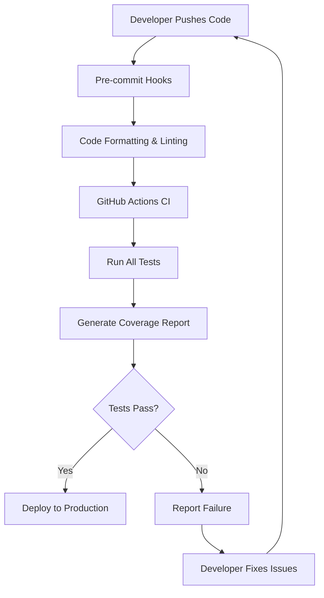

# Testing and Development Tutorial

Welcome to the testing and development tutorial! This guide will teach you how to test your FastAPI application, debug issues, and follow best practices for development.

---

## What is Testing?

Think of testing like quality control for your app. Just like a car manufacturer tests every car before selling it, you need to test your app to make sure it works correctly before users see it.

---

## Why Testing is Important

- **Catch bugs early**: Find problems before they reach users
- **Ensure reliability**: Make sure your app works consistently
- **Safe changes**: Modify code without breaking existing features
- **Documentation**: Tests show how your code should work
- **Confidence**: Know your app works before deploying

---

## 🧪 Testing Tools Included

### 🔍 Testing Framework
- **Pytest**: Modern Python testing framework
- **Test Coverage**: See how much of your code is tested
- **Async Testing**: Test async functions properly
- **Fixtures**: Reusable test setup and teardown

### 🛠️ Code Quality Tools
- **Mypy**: Type checking to catch type errors
- **Ruff**: Fast Python linter and formatter
- **Black**: Code formatting for consistent style
- **Pre-commit**: Automatic checks before committing

### 🚀 Development Tools
- **Hot Reload**: Automatic server restart on code changes
- **Debug Mode**: Detailed error messages and stack traces
- **Logging**: Comprehensive logging for debugging
- **Health Checks**: Monitor application status

---

## How to Run Tests

### Basic Test Commands

```bash
# Run all tests
pytest tests/ -v

# Run tests with coverage report
pytest --cov=app --cov-report=html

# Run only failed tests
pytest --last-failed

# Run a specific test file
pytest tests/template_tests/test_auth.py

# Run a specific test function
pytest tests/template_tests/test_auth.py::test_login

# Run tests matching a keyword
pytest -k "test_login"

# Run tests in parallel (faster)
pytest -n auto
```

### Test Output Examples

```bash
# Successful test run
pytest tests/template_tests/test_auth.py -v
============================= test session starts ==============================
collecting ... collected 5 items

tests/template_tests/test_auth.py::test_register_user PASSED        [ 20%]
tests/template_tests/test_auth.py::test_login_user PASSED          [ 40%]
tests/template_tests/test_auth.py::test_login_invalid_credentials PASSED [ 60%]
tests/template_tests/test_auth.py::test_protected_route PASSED      [ 80%]
tests/template_tests/test_auth.py::test_refresh_token PASSED       [100%]

============================== 5 passed in 2.34s ==============================

# Failed test run
pytest tests/template_tests/test_auth.py::test_login -v
============================= test session starts ==============================
collecting ... collected 1 item

tests/template_tests/test_auth.py::test_login FAILED               [100%]

================================= FAILURES ==================================
_____________________________ test_login _____________________________

def test_login(client, test_user):
    response = client.post("/api/v1/auth/login", data={
        "username": test_user.email,
        "password": "wrongpassword"
    })
>   assert response.status_code == 200
E   assert 401 == 200
E    +  where 401 = <Response [401]>.status_code

tests/template_tests/test_auth.py:45: AssertionError
============================== 1 failed in 0.12s ==============================
```

---

## Basic Test Examples

### Simple API Test

Here's a basic test you can add to `tests/test_example.py`:

```python
def test_health_endpoint(client):
    """Test that the health endpoint returns 200."""
    response = client.get("/health")
    assert response.status_code == 200
    assert response.json()["status"] == "healthy"

def test_users_endpoint_requires_auth(client):
    """Test that protected endpoints require authentication."""
    response = client.get("/api/v1/users/me")
    assert response.status_code == 401  # Unauthorized
```

### Authentication Test

```python
def test_user_registration(client):
    """Test user registration flow."""
    # Register a new user
    response = client.post("/api/v1/auth/register", json={
        "email": "test@example.com",
        "username": "testuser",
        "password": "TestPassword123!"
    })
    
    assert response.status_code == 201
    data = response.json()
    assert data["email"] == "test@example.com"
    assert data["username"] == "testuser"
    assert "id" in data

def test_user_login(client, test_user):
    """Test user login with valid credentials."""
    response = client.post("/api/v1/auth/login", data={
        "username": test_user.email,
        "password": "TestPassword123!"
    })
    
    assert response.status_code == 200
    data = response.json()
    assert "access_token" in data
    assert data["token_type"] == "bearer"
```

### Database Test

```python
def test_create_user_in_database(db_session):
    """Test creating a user directly in the database."""
    from app.crud.user import create_user_sync
    from app.schemas.user import UserCreate
    
    user_data = UserCreate(
        email="db_test@example.com",
        username="dbtestuser",
        password="TestPassword123!"
    )
    
    user = create_user_sync(db_session, user_data)
    assert user.email == "db_test@example.com"
    assert user.username == "dbtestuser"
    assert user.is_verified is False
```

---

## Where Tests Live

Tests are organized in the `tests/` folder:

```
tests/
├── __init__.py
├── template_tests/
│   ├── conftest.py              # Test configuration and fixtures
│   ├── test_admin.py            # Admin functionality tests
│   ├── test_api_auth.py         # Authentication API tests
│   ├── test_api_users.py        # User management API tests
│   ├── test_async_basic.py      # Async function tests
│   ├── test_audit_log.py        # Audit logging tests
│   ├── test_auth_account_deletion.py  # Account deletion tests
│   ├── test_auth_email_verification.py # Email verification tests
│   ├── test_auth_oauth.py       # OAuth authentication tests
│   ├── test_auth_password_change.py # Password change tests
│   ├── test_auth_password_reset.py # Password reset tests
│   ├── test_auth_validation.py  # Input validation tests
│   ├── test_celery_api.py       # Celery API tests
│   ├── test_celery_health.py    # Celery health tests
│   ├── test_celery_mocked.py    # Mocked Celery tests
│   ├── test_celery.py           # Celery integration tests
│   ├── test_connection_pooling.py # Database connection tests
│   ├── test_cors.py             # CORS configuration tests
│   ├── test_crud.py             # Database CRUD tests
│   ├── test_email.py            # Email functionality tests
│   ├── test_error_responses.py  # Error handling tests
│   ├── test_health.py           # Health check tests
│   ├── test_logging.py          # Logging configuration tests
│   ├── test_main.py             # Main application tests
│   ├── test_models.py           # Database model tests
│   ├── test_oauth.py            # OAuth integration tests
│   ├── test_optional_features.py # Optional features tests
│   ├── test_pagination.py       # Pagination tests
│   ├── test_pgbouncer_integration.py # Connection pooling tests
│   ├── test_precommit.py        # Pre-commit hook tests
│   ├── test_rate_limiting.py    # Rate limiting tests
│   ├── test_redis.py            # Redis integration tests
│   ├── test_refresh_token.py    # Refresh token tests
│   ├── test_search_filter_api.py # Search and filter API tests
│   ├── test_search_filter_patch.py # Search filter patch tests
│   ├── test_search_filter.py    # Search and filter tests
│   ├── test_security.py         # Security feature tests
│   ├── test_sentry.py           # Sentry integration tests
│   ├── test_soft_delete.py      # Soft delete tests
│   ├── test_superuser.py        # Superuser functionality tests
│   ├── test_users_pagination.py # User pagination tests
│   └── test_websocket.py        # WebSocket tests
```

---

## Writing Your Own Tests

### Test Structure

```python
def test_something(client, db_session):
    """Test description - what you're testing."""
    # Arrange - Set up test data
    # Act - Perform the action you're testing
    # Assert - Check the results
```

### Using Fixtures

The template provides many useful fixtures:

> **See all available fixtures in [`tests/template_tests/conftest.py`](../../tests/template_tests/conftest.py) for details and customization.**

```python
def test_with_user(client, test_user):
    """Test that uses a pre-created test user."""
    # test_user is automatically created and cleaned up
    response = client.get(f"/api/v1/users/{test_user.id}")
    assert response.status_code == 200

def test_with_superuser(client, superuser):
    """Test that uses a pre-created superuser."""
    # superuser has admin privileges
    response = client.get("/api/v1/admin/users")
    assert response.status_code == 200
```

### Testing Async Functions

```python
import pytest

@pytest.mark.asyncio
async def test_async_function():
    """Test an async function."""
    from app.services.email import send_email_async
    
    result = await send_email_async("test@example.com", "Test", "Hello")
    assert result is True
```

---

## CI/CD Test Lifecycle



---

## What CI Does with Tests

### GitHub Actions Workflow

When you push code or create a pull request:

1. **Pre-commit Hooks**: Automatic code formatting and linting
2. **Run All Tests**: Execute the full test suite
3. **Generate Coverage**: Calculate test coverage percentage
4. **Report Results**: Show pass/fail status and coverage
5. **Block Deployment**: Prevent deployment if tests fail

### CI Configuration

The template includes a GitHub Actions workflow (`.github/workflows/ci.yml`):

```yaml
name: CI
on: [push, pull_request]
jobs:
  test:
    runs-on: ubuntu-latest
    steps:
      - uses: actions/checkout@v3
      - name: Set up Python
        uses: actions/setup-python@v4
        with:
          python-version: '3.11'
      - name: Install dependencies
        run: pip install -r requirements.txt
      - name: Run tests
        run: pytest --cov=app --cov-report=xml
      - name: Upload coverage
        uses: codecov/codecov-action@v3
```

---

## Development Best Practices

### Code Quality Tools

```bash
# Format code with Black
black app/ tests/

# Lint code with Ruff
ruff check app/ tests/

# Type check with Mypy
mypy app/

# Run all quality checks
./scripts/lint.sh
```

### Pre-commit Hooks

The template includes pre-commit hooks that run automatically:

```bash
# Install pre-commit hooks
pre-commit install

# Run manually
pre-commit run --all-files
```

**Example `.pre-commit-config.yaml`**
```yaml
repos:
  - repo: https://github.com/charliermarsh/ruff-pre-commit
    rev: v0.3.0
    hooks:
      - id: ruff
  - repo: https://github.com/psf/black
    rev: 23.7.0
    hooks:
      - id: black
  - repo: https://github.com/pre-commit/mirrors-mypy
    rev: v1.5.1
    hooks:
      - id: mypy
```
This will automatically run Ruff, Black, and Mypy on every commit to ensure code quality and type safety.

### Debugging Tips

```python
# Add debug prints
print(f"Debug: {variable}")

# Use Python debugger
import pdb; pdb.set_trace()

# Use logging
import logging
logging.debug(f"Debug message: {variable}")
```

---

## Testing Database Operations

### Test Database Setup

The template automatically creates a test database:

```python
def test_database_operations(db_session):
    """Test database operations with isolated test database."""
    from app.models.models import User
    
    # Create a user
    user = User(email="test@example.com", username="testuser")
    db_session.add(user)
    db_session.commit()
    
    # Query the user
    found_user = db_session.query(User).filter_by(email="test@example.com").first()
    assert found_user.username == "testuser"
    
    # Clean up is automatic
```

### Testing Migrations

```python
def test_migration_works(alembic_runner):
    """Test that migrations can be applied and rolled back."""
    # Apply all migrations
    alembic_runner.migrate()
    
    # Check current revision
    current = alembic_runner.current()
    assert current is not None
    
    # Roll back one migration
    alembic_runner.rollback()
```

---

## Glossary

- **Pytest**: A modern Python testing framework that makes it easy to write simple and scalable test cases.
- **Fixture**: A function that provides a fixed baseline for tests, setting up test data or objects.
- **Coverage**: A measure of how much of your code is executed during testing.
- **CI/CD**: Continuous Integration/Continuous Deployment, automated processes for building, testing, and deploying code.
- **Linting**: Static code analysis that checks for programming errors, bugs, and suspicious constructs.
- **Type Checking**: Verifying that variables are used with the correct data types.
- **Pre-commit**: A framework for managing and maintaining pre-commit hooks.
- **Async Testing**: Testing asynchronous functions that use `async`/`await` syntax.

---

## Next Steps

Now that you understand testing and development, you can:
1. **Write comprehensive tests** for your new features
2. **Set up continuous integration** for automated testing
3. **Improve code quality** with linting and formatting
4. **Debug issues efficiently** using the tools provided
5. **Monitor your application** in production
6. **Add test coverage** to ensure all code paths are tested
7. **Create integration tests** for complex workflows
8. **Set up performance testing** for critical endpoints

Remember: Good testing practices will save you time in the long run and give you confidence that your app works correctly! 